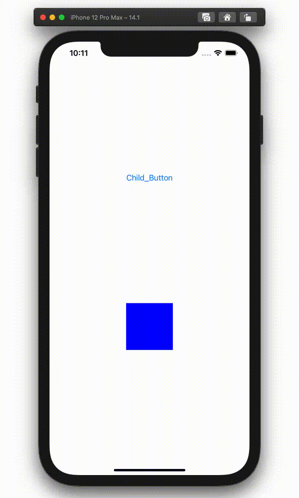
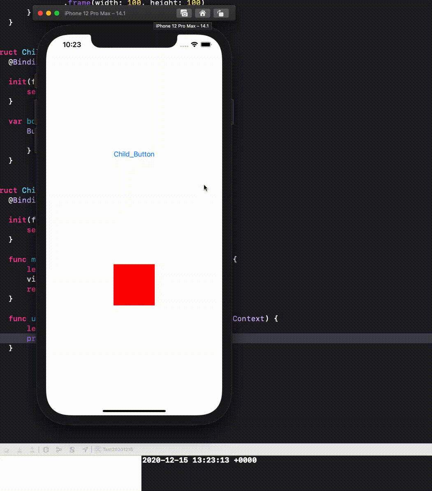
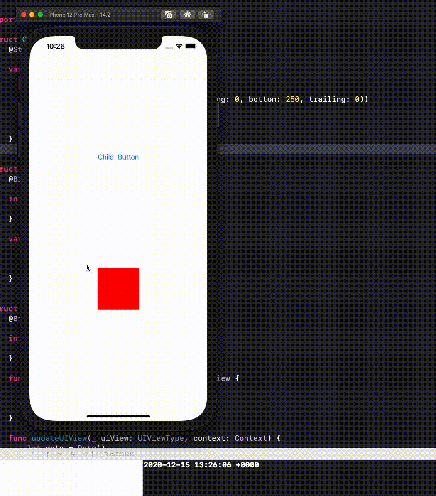

  
<!--more-->  
  
## 要約
  
- iOS14.1以前とiOS14.2以降でUIViewRepresentableのupdateUIViewの呼ばれるタイミングが異なる  
- iOS14.1以前ではviewと関係のないプロパティが変更されたときにupdateUIViewが呼ばれるが、iOS14.2以降では呼ばれない  
- viewと関係のないプロパティが変更された時にupdateUIViewを呼ぶためにはEnvironmentObjectを使えば良さそう  
  
## 開発環境  
  
```bash
> xcodebuild -version
Xcode 12.3
Build version 12C33
```
  
## UIViewRepresentable
> A wrapper for a UIKit view that you use to integrate that view into your SwiftUI view hierarchy.  
> [UIViewRepresentable | Apple Developer Documentation](https://developer.apple.com/documentation/swiftui/uiviewrepresentable)
  
UIKitのViewをSwiftUIで使うためのラッパー。  
UIViewRepresentableはupdateUIViewというメソッドを持つ。  
  
　
  
> SwiftUI calls this method for any changes affecting the corresponding UIKit view.  
> [updateUIView(_:context:) | Apple Developer Documentation](https://developer.apple.com/documentation/swiftui/uiviewrepresentable/updateuiview(_:context:))  
  
updateUIViewは対応する **UIKit viewに影響を与える変更** に対して呼ばれる。  
  
## 「any changes affecting the corresponding UIKit view」  
**UIKit viewに影響を与える変更** に対してupdateUIViewが呼び出されるのか確認する。  
  
```swift
import SwiftUI

struct ContentView: View {
    @State private var flag: Bool = false
    
    var body: some View {
        VStack {
            ChildButtonView(flag: $flag)
                .padding(EdgeInsets(top: 0, leading: 0, bottom: 250, trailing: 0))
            ChildRedOrBlueView(flag: $flag)
                .frame(width: 100, height: 100)
        }
    }
}

struct ChildButtonView: View {
    @Binding var flag: Bool
    
    init(flag: Binding<Bool>) {
        self._flag = flag
    }
    
    var body: some View {
        Button("Child_Button"){
            flag.toggle()
        }
    }
}

struct ChildRedOrBlueView: UIViewRepresentable {
    @Binding var flag: Bool
    
    init(flag: Binding<Bool>) {
        self._flag = flag
    }
    
    func makeUIView(context: Context) -> some UIView {
        let view = UIView()
        view.backgroundColor = .red
        return view
    }
    
    func updateUIView(_ uiView: UIViewType, context: Context) {
        uiView.backgroundColor = (flag ? .red : .blue)
    }
}
```
  
　
  
  
  
　
  
ContentViewの@Stateプロパティ `flag` をChildButtonView, ChildRedOrBlueViewでバインディングしている。  
ChildButtonViewのButton押下時にバインディング元のContentViewのflagが変更され、バインディングしているChildRedOrBlueViewのflagに値が伝搬が行われ、updateUIViewが呼ばれる。  
上記のシミュレーターはiOS14.1だが、iOS14.2でも同様の結果となる。  
  
## !「any changes affecting the corresponding UIKit view」  
**UIKit viewに影響を与えない変更** に対してこのメソッドが呼び出されるのか検証する。  
  
```swift
import SwiftUI

struct ContentView: View {
    @State private var flag: Bool = false
    
    var body: some View {
        VStack {
            ChildButtonView(flag: $flag)
                .padding(EdgeInsets(top: 0, leading: 0, bottom: 250, trailing: 0))
            ChildRedView(flag: $flag)
                .frame(width: 100, height: 100)
        }
    }
}

struct ChildButtonView: View {
    @Binding var flag: Bool
    
    init(flag: Binding<Bool>) {
        self._flag = flag
    }
    
    var body: some View {
        Button("Child_Button"){
            flag.toggle()
        }
    }
}

struct ChildRedView: UIViewRepresentable {
    @Binding var flag: Bool
    
    init(flag: Binding<Bool>) {
        self._flag = flag
    }
    
    func makeUIView(context: Context) -> some UIView {
        let view = UIView()
        view.backgroundColor = .red
        return view
    }
    
    // flagはviewに関係ないプロパティだからflagが他要素で変更されたらメソッドは呼ばれない？
    func updateUIView(_ uiView: UIViewType, context: Context) {
        let date = Date()
        print(date)
    }
}
```
  
　
  
|||
| ---- | ---- |
|iOS14.1|iOS14.2|
|ターミナルに追記されている|ターミナル変化無し| 
  
　
  
iOS14.1はUIKit viewに影響を与えない変更に対してupdateUIViewが呼ばれていることが分かる。  
  
　
  
> SwiftUI calls this method for any changes affecting the corresponding UIKit view.  
  
これはiOS14.1では通用しないことが分かった。  
iOS14.2では説明通りに、viewに関係がある変更があった場合にupdateUIViewが呼ばれる。（iOS14.3も同様）  
  
## iOS14.2以降でもviewと関係のないプロパティが変更された時にupdateUIViewを呼びたい
  
```swift
import SwiftUI

struct ContentView: View {
    var observableProperty = ObservableProperty()
    
    var body: some View {
        VStack {
            ChildButtonView()
                .padding(EdgeInsets(top: 0, leading: 0, bottom: 250, trailing: 0))
            ChildRedView()
                .frame(width: 100, height: 100)
        }
        .environmentObject(observableProperty)
    }
}

struct ChildButtonView: View {
    @EnvironmentObject var observableProperty: ObservableProperty
    
    var body: some View {
        Button("Child_Button"){
            observableProperty.flag.toggle()
        }
    }
}

struct ChildRedView: UIViewRepresentable {
    @EnvironmentObject var observableProperty: ObservableProperty
    
    func makeUIView(context: Context) -> some UIView {
        let view = UIView()
        view.backgroundColor = .red
        return view
    }
    
    func updateUIView(_ uiView: UIViewType, context: Context) {
        let date = Date()
        print(date)
    }
}

class ObservableProperty: ObservableObject {
    @Published var flag = false
}

```
  
## 参考  
- [UIViewRepresentable | Apple Developer Documentation](https://developer.apple.com/documentation/swiftui/uiviewrepresentable)
- [updateUIView(_:context:) | Apple Developer Documentation](https://developer.apple.com/documentation/swiftui/uiviewrepresentable/updateuiview(_:context:))
- [ObservableObject | Apple Developer Documentation](https://developer.apple.com/documentation/combine/observableobject)
- [EnvironmentObject | Apple Developer Documentation](https://developer.apple.com/documentation/swiftui/environmentobject)  