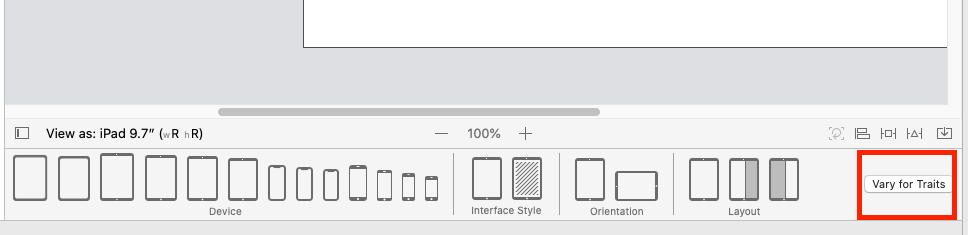
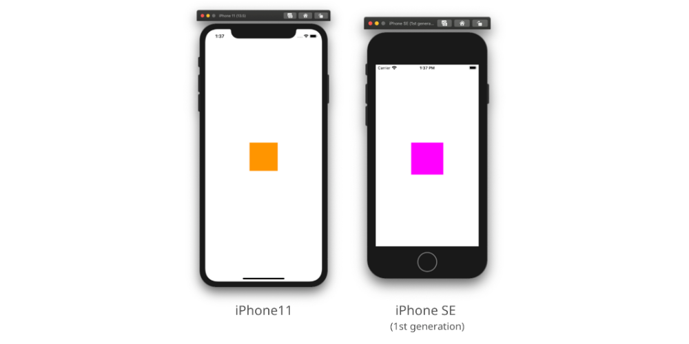

Vary for Traitsではレイアウト別に色が変更できない。  
<!--more-->  
## 開発環境  
  
```bash
Xcode: Version 11.5 (11E608c)  
Apple Swift version 5.2.4 (swiftlang-1103.0.32.9 clang-1103.0.32.53)
Target: x86_64-apple-darwin19.5.0
```
  
## Vary for Traits でレイアウト別の色変更はできない  
スクリーンサイズ別で制約を変更する場合は Vary for Traits を使用するが、レイアウト別での色変更はできない。  
  
 
## 画面サイズに応じてUIVIewの色を変更  
試しに iPhone SE (1st generation) のみUIViewの色を変更する。  
  
## 手順  
  
1. iPhone SE (1st generation)シミュレータ上でスクリーンサイズを取得  
2. スクリーンサイズが1と同じ場合にUIViewの色を変更  
  
### 1. iPhone SE (1st generation)シミュレータ上でスクリーンサイズを取得  
  
アプリが起動しているスクリーンサイズを取得する処理を記載した上で、iPhone SE (1st generation)シミュレータを起動。  
  
```swift
import UIKit

class ViewController: UIViewController {
    
    override func viewDidLoad() {
        super.viewDidLoad()
    
        let screenSize: CGSize = UIScreen.main.bounds.size
        debugPrint(screenSize) // (320.0, 568.0)
    }
}
```
  
### 2. スクリーンサイズが1と同じ場合にUIViewの色を変更  
  
```swift
import UIKit

class ViewController: UIViewController {
    
    @IBOutlet weak var testView: UIView!
    
    let se1ScreenSize = CGSize(width: 320.0, height: 568.0)
    
    override func viewDidLoad() {
        super.viewDidLoad()

        let screenSize: CGSize = UIScreen.main.bounds.size
        
        if screenSize == se1ScreenSize {
            testView.backgroundColor = .magenta
        }
    }
}
```
  
### 比較  
  
  
サイズごとにプロパティを変更するのはコードが長くなりそうなので他の方法も考えたい。  
  