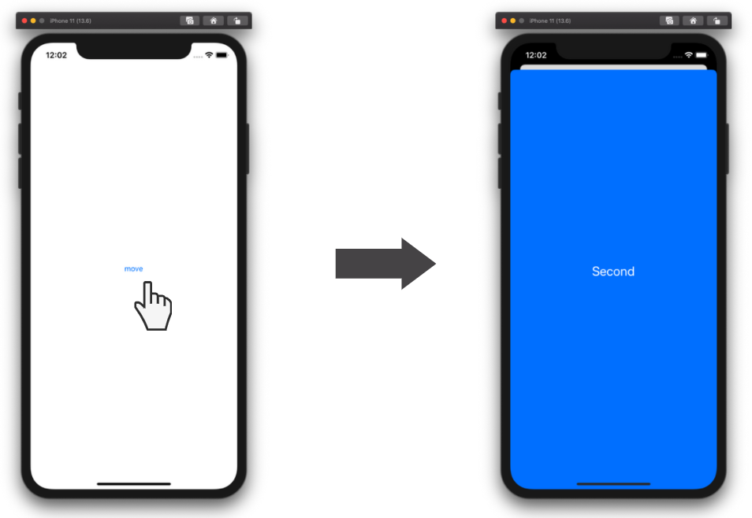
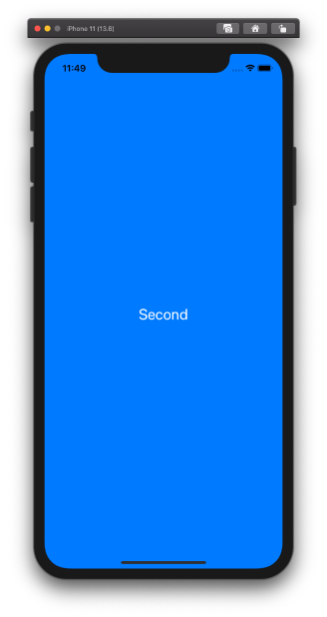

  
モーダル遷移時（非フルスクリーン）に、遷移前 ViewContoller(以下、VC) の処理を実行したい。  
  
<!--more-->  
  
## モーダル遷移  
  
  
  
モーダル遷移： 下から遷移先の画面が被さるアニメーションを伴う遷移方法。  
  
## 開発環境  
  
```bash
Xcode: Version 11.6 (11E708)  
Apple Swift version 5.2.4 (swiftlang-1103.0.32.9 clang-1103.0.32.53)
Target: x86_64-apple-darwin19.6.0
```
  
## モーダル遷移の実装  
  
UIButton 押下で別のVCに遷移。  
  
何も指定しない場合、遷移元の画面が少し見える。  
[View Hierarchy](https://developer.apple.com/library/archive/documentation/ToolsLanguages/Conceptual/Xcode_Overview/ExaminingtheViewHierarchy.html) からも、遷移元VCの存在が確認できる。  
  
  
  
```swift
import UIKit

class ViewController: UIViewController {

    override func viewDidLoad() {
        super.viewDidLoad()
    }

    @IBAction func move(_ sender: Any) {
        let vc = self.storyboard?.instantiateViewController(withIdentifier: "second")
        self.present(vc!, animated: true, completion: nil)
    }
    
}
```
  
　
  
--- 
  
　
  
フルスクリーン遷移させた場合は、遷移元VCは残っていない。  
View Hierarchy からも、遷移元VCの存在が確認できなかった。  
  
  
  
```swift
@IBAction func move(_ sender: Any) {
    let vc = self.storyboard?.instantiateViewController(withIdentifier: "second")
    vc?.modalPresentationStyle = .fullScreen  // 追加
    self.present(vc!, animated: true, completion: nil)
}
```
  
## 非フルスクリーン遷移時に遷移元VCの処理を実行  
本題。  
非フルスクリーン遷移時に、遷移元VCの処理を行うことを考える。  
  
フルスクリーン遷移時は、遷移元VCの`viewDidDisappear(_:)` が呼ばれるため、 `override` させたメソッド内に処理を実装すれば良い。  
  
非フルスクリーン遷移時は、遷移元VCが存在しているため、フルスクリーン遷移時と同様の処理はできない。  
そこで、`presentingViewController` で遷移元VCの処理を遷移先VCで実行してみた。  

## presentingViewController  
[presentingViewController](https://developer.apple.com/documentation/uikit/uiviewcontroller/1621430-presentingviewcontroller) は遷移元VCを返す。  
返したVCの型を遷移元VCの型で強制キャストすれば、遷移元VCの処理を呼ぶことができる。  
  
### 遷移元VC  
  
```swift:a.swift
import UIKit

class ViewController: UIViewController {

    override func viewDidLoad() {
        super.viewDidLoad()
    }
    
    @IBAction func move(_ sender: Any) {
        let vc = self.storyboard?.instantiateViewController(withIdentifier: "second") as! SecondViewController
        self.present(vc, animated: true, completion: nil)
    }
    
    // 遷移先で実行する
    func hoge() {
        print(1)
    }
}
```
  
### 遷移先VC 
  
```swift
import UIKit

class SecondViewController: UIViewController {
    
    override func viewDidLoad() {
        super.viewDidLoad()

        let presentingVC = presentingViewController as! ViewController
        presentingVC.hoge()  // 1

    }
}
```
  
`presentingViewController` は遷移元VCの型ではなく、遷移元VCそのものを返す。  
よって、プロパティの値は遷移元VCで処理済みのものを参照できる。  
  
遷移元VCを下記のように修正。  

### 遷移元VC  
  
```swift
import UIKit

class ViewController: UIViewController {

    var num = 1
    
    override func viewDidLoad() {
        super.viewDidLoad()
        num = 5
    }
    
    @IBAction func move(_ sender: Any) {
        let vc = self.storyboard?.instantiateViewController(withIdentifier: "second") as! SecondViewController
        self.present(vc, animated: true, completion: nil)
    }
    
    func hoge() {
        print("num: \(num)")  // 遷移先VCでの実行 → num: 5
    }
}

```
  
もし型のみを返すなら、`num` が1（初期化時と同じ）となるはずなので、`presentingViewController` は遷移元VCの型ではなく、遷移元VCそのものを返していることが分かる。  
  
## 所感  
上記に記載した、フルスクリーン時、非フルスクリーン時の処理実行時のタイミングは異なる。  
  
- フルスクリーン時：遷移元VCの viewDidDisappear(_:)  
- 非フルスクリーン時：遷移先VCの viewDidLoad()  
  
完全に同じタイミングで遷移元VCの処理を実行する方法を模索していきたい。  
  
## 参考  
  
- [viewDidDisappear(_:) | Apple Developer Documentation](https://developer.apple.com/documentation/uikit/uiviewcontroller/1621477-viewdiddisappear)  
- [Xcode Overview: Examining the View Hierarchy](https://developer.apple.com/library/archive/documentation/ToolsLanguages/Conceptual/Xcode_Overview/ExaminingtheViewHierarchy.html)  
- [presentingViewController | Apple Developer Documentation](https://developer.apple.com/documentation/uikit/uiviewcontroller/1621430-presentingviewcontroller)  