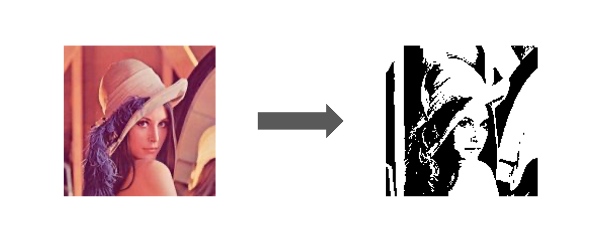
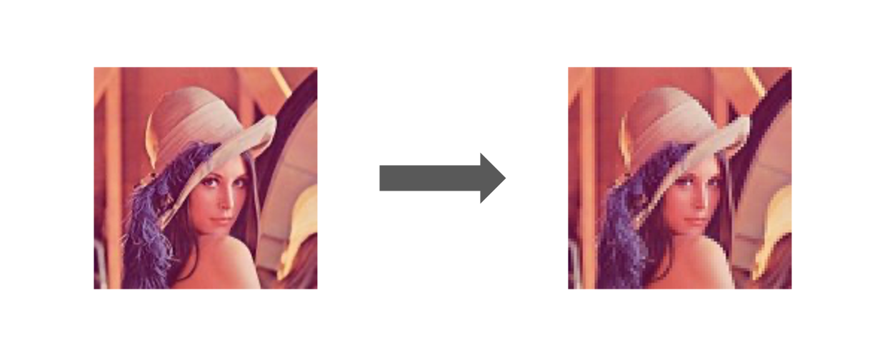
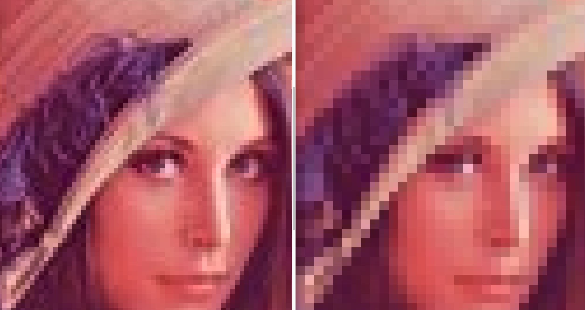
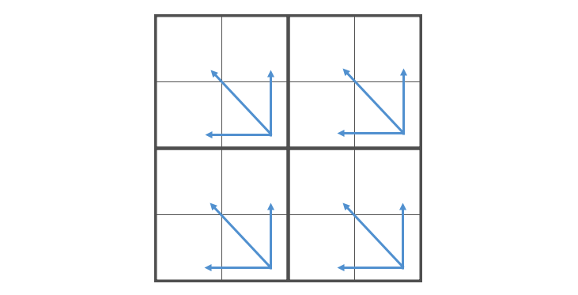

  
楽しい（直球）  
  
<!--more-->  
  
## 開発環境  
  
```bash
> go version
go version go1.16 darwin/amd64
```
  
## 二値化  
  
  
  
　
  
```go
package main

import (
	"image"
	"log"
	"os"

	"image/color"
	"image/jpeg"
)

func main() {

	png, err := os.Open("./Lenna.jpeg")
	if err != nil {
		log.Fatal(err.Error())
	}
	defer png.Close()

	img, err := jpeg.Decode(png)
	if err != nil {
		log.Fatalln(err.Error())
	}

	bounds := img.Bounds()

	result := image.NewRGBA(bounds)

	threshold := 255 / 2

	for y := bounds.Min.Y; y < bounds.Max.Y; y++ {
		for x := bounds.Min.X; x < bounds.Max.X; x++ {
			pixel := img.At(x, y)

			// それぞれ 16bit に変換される (~0xffff)
			r, g, b, a := pixel.RGBA()

			// 0xffff -> 0xff
			r, g, b, a = r>>8, g>>8, b>>8, a>>8

			mean := (r + g + b) / 3

			if uint8(mean) >= uint8(threshold) {
				col := color.RGBA{R: uint8(255), G: uint8(255), B: uint8(255), A: uint8(0)}
				result.Set(x, y, col)
			} else {
				col := color.RGBA{R: uint8(0), G: uint8(0), B: uint8(0), A: uint8(0)}
				result.Set(x, y, col)
			}
		}
	}

	quality := &jpeg.Options{Quality: 100}
	err = jpeg.Encode(os.Stdout, result, quality)
	if err != nil {
		log.Fatal(err.Error())
	}

}

```
  
　
  
```bash
> go run main.go > hoge.jpg
```
  
## モザイク
  
  
  
　
  
分かりにくいので拡大。  
  
  
  
　
  
```go
package main

import (
	"image"
	"log"
	"os"

	"image/color"
	"image/jpeg"
)

func main() {

	png, err := os.Open("./Lenna.jpeg")
	if err != nil {
		log.Fatal(err.Error())
	}
	defer png.Close()

	img, err := jpeg.Decode(png)
	if err != nil {
		log.Fatalln(err.Error())
	}

	bounds := img.Bounds()

	result := image.NewRGBA(bounds)

	var dx []int = []int{-1, -1, 0, 0}
	var dy []int = []int{-1, 0, -1, 0}

	for y := 1; y < bounds.Max.Y; y += 2 {
		for x := 1; x < bounds.Max.X; x += 2 {
			var rt uint32 = 0
			var gt uint32 = 0
			var bt uint32 = 0
			for di := 0; di < 4; di++ {
				nx := x + dx[di]
				ny := y + dy[di]
				pixel := img.At(nx, ny)
				r, g, b, a := pixel.RGBA()
				r, g, b, a = r>>8, g>>8, b>>8, a>>8
				rt += r
				gt += g
				bt += b
			}

			rm, gm, bm := rt/4, gt/4, bt/4
			for di := 0; di < 4; di++ {
				nx := x + dx[di]
				ny := y + dy[di]
				col := color.RGBA{R: uint8(rm), G: uint8(gm), B: uint8(bm), A: uint8(0)}
				result.Set(nx, ny, col)
			}
		}
	}

	quality := &jpeg.Options{Quality: 100}
	err = jpeg.Encode(os.Stdout, result, quality)
	if err != nil {
		log.Fatal(err.Error())
	}

}
```
  
#### 実装イメージ  
  
  
  
4マスの RGB 値の平均を取って、4マスそれぞれに平均をいれて出力。  
  
## 参考  
  
- [color - The Go Programming Language](https://golang.org/pkg/image/color/#Color)  
- [jpeg - The Go Programming Language](https://golang.org/pkg/image/jpeg/)  
