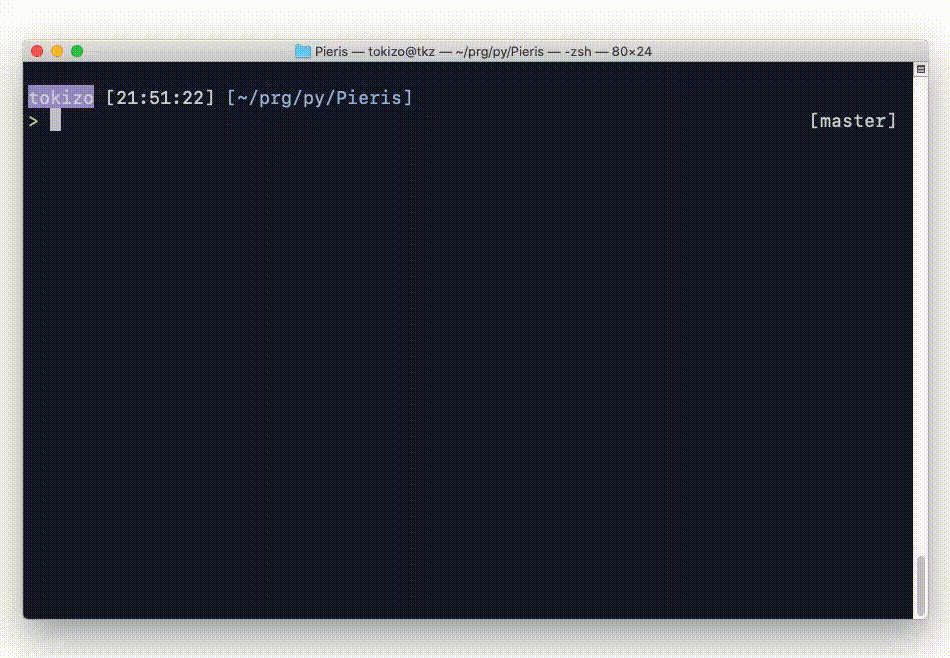

  
Xcodeで作成したプロジェクトファイル内で継承していないのにfinalが付与されていないクラス名を抽出する。(気合実装編)  

  
<!--more-->  
  
## 開発環境  
  
```bash
> python -V
Python 3.8.5
```
  
## 作ったもの
  

  
## コード  
  
```python
import os
import sys
import pathlib

TARGET_EXPAND = '.swift'


class ClassFile:

    name: str
    path: str

    def __init__(self, name, path):
        self.name = name
        self.path = path


class Color:

    RED    = '\033[31m' 
    YELLOW = '\033[33m'
    RESET  = '\033[0m'


def main():
    # 1. コマンドライン引数からプロジェクトディレクトリのパスを取得する
    args = sys.argv
    if len(args) < 2 or not os.path.isdir(args[1]):
        error_message = "{}ERROR: Please input Project Directory Path{}".format(Color.RED, Color.RESET)
        exit(error_message)

    path = args[1]
    p = pathlib.Path(path)
    inherited_class_names = set()
    class_files: [ClassFile] = []

    # 2. 1のディレクトリ配下を再帰的に探索
    file_paths = p.glob('**/*')
    for f in file_paths:
        file_path = str(f)

        if not os.path.isfile(file_path) or not has_expand(expand=TARGET_EXPAND, file_path=file_path):
            continue
        
        for line in  open(file_path, 'r'):
            words = line.split()

            if len(words) == 0:
                continue

            if words[0] == 'class':
                class_files.append(ClassFile(name=words[1][:-1], path=file_path))
                [inherited_class_names.add(i) for i in extract_inherited_class_names(words)]
            elif words[0] == 'extension':
                if words[1][-1] == ':':
                    [inherited_class_names.add(i) for i in extract_inherited_class_names(words)]
            
    not_inherited_class_files = [class_name for class_name in class_files if class_name not in inherited_class_names]

    print("{}[Warning] Not inherited but not given final qualifier.{}".format(Color.YELLOW, Color.RESET))
    for not_inherited_class_file in not_inherited_class_files:
        print(not_inherited_class_file.path)


def has_expand(expand: str, file_path: str) -> bool:
    return expand == file_path[-len(expand):]


def extract_inherited_class_names(line: str) -> [str]:
    return line[2:-1]


main()
```
  
[tokizuoh/Pieris](https://github.com/tokizuoh/Pieris)  
  
　
  
時間あるときに正規表現で書き直す。  
[SwiftLint](https://github.com/realm/SwiftLint)に吸収させたい。  
  
## 参考
- [glob --- Unix 形式のパス名のパターン展開](https://docs.python.org/ja/3/library/glob.html)