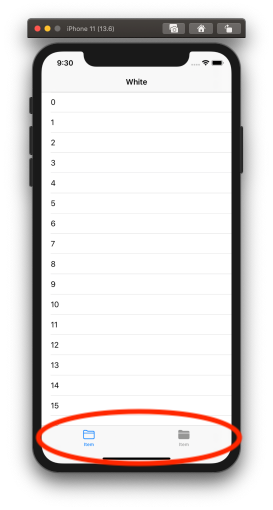
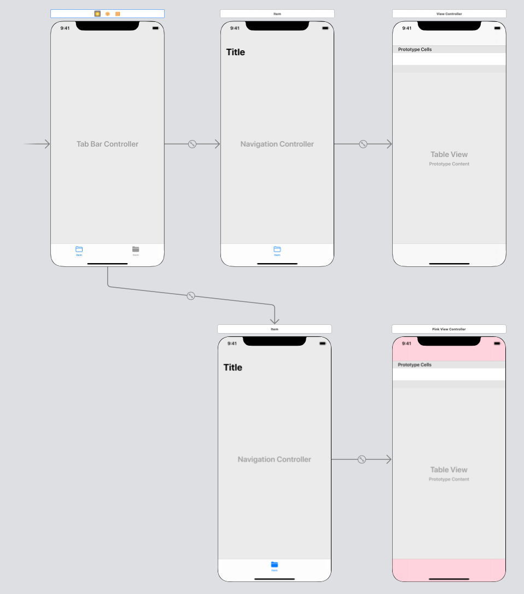

  
下タブ。下タブ押下時の処理も書いた。  
<!--more-->  
  
以下、ViewControllerをVCとする。  
  
## UITabBarController  
  
  
  
> A container view controller that manages a multiselection interface, where the selection determines which child view controller to display.  
>  
> (from: [UITabBarController | Apple Developer Documentation](https://developer.apple.com/documentation/uikit/uitabbarcontroller))  
  
## 開発環境  
  
```bash
Xcode: Version 11.6 (11E708)  
Apple Swift version 5.2.4 (swiftlang-1103.0.32.9 clang-1103.0.32.53)
Target: x86_64-apple-darwin19.6.0
```
  
## 実装したもの  
  
  
  
### ポイント  
  
- 1つ目のタブ押下で TableView を一番上に遷移  
- 2つ目のタブ押下で TableView を一番下に遷移  
- タブ遷移時には上記の処理を行わない（以前の状態を保つ）  
  
## Storyboard全体  
  
  
  
Xcode > Editor > Embed in > TabBacController  
  
## TableViewの位置変更  
  
タブ押下時の TableView の位置変更の実装。  
  
```swift
extension PinkViewController: UITabBarControllerDelegate {
    func tabBarController(_ tabBarController: UITabBarController, didSelect viewController: UIViewController) {
        // 後述
        if tabBarController.selectedIndex != 1 {
            return
        }
        
        tableView.scrollToRow(at: IndexPath(row: items.count - 1, section: 0), at: .bottom, animated: true)
    }
}
```
  
## タブ押下時の処理でハマったところ  
  
### 問題  
下タブ押下時の処理は `UITabBarControllerDelegate` を準拠させたクラスに書く。  
そこで、下記の事象にあたった。  
  
1. VC1 で VC2 に紐づく下タブ押下  
2. VC2 で VC1 に紐づく下タブ押下  
  
2.の際に、VC1 遷移時に VC2 で `UITabBarControllerDelegate` を準拠させたクラスの処理が実行されてしまう。  
  
### 解決法  
  
現在のVCとTabBarControllerが保有しているVCで比較してdelegateの切り替えを行おうとしたが、上手くいかなかった。  
そこで、[selectedIndex](https://developer.apple.com/documentation/uikit/uitabbarcontroller/1621171-selectedindex) を用いて解決した。  
  
```swift
extension PinkViewController: UITabBarControllerDelegate {
    func tabBarController(_ tabBarController: UITabBarController, didSelect viewController: UIViewController) {
        
        // 1は PinkViewController が TabBarController に登録されている index
        if tabBarController.selectedIndex != 1 {
            return
        }
        
        // 処理
    }
}
```
  
## 参考  
- [UITabBarController | Apple Developer Documentation](https://developer.apple.com/documentation/uikit/uitabbarcontroller)  
- [scrollToRow(at:at:animated:) | Apple Developer Documentation](https://developer.apple.com/documentation/uikit/uitableview/1614997-scrolltorow)  
- [selectedIndex | Apple Developer Documentation](https://developer.apple.com/documentation/uikit/uitabbarcontroller/1621171-selectedindex)  