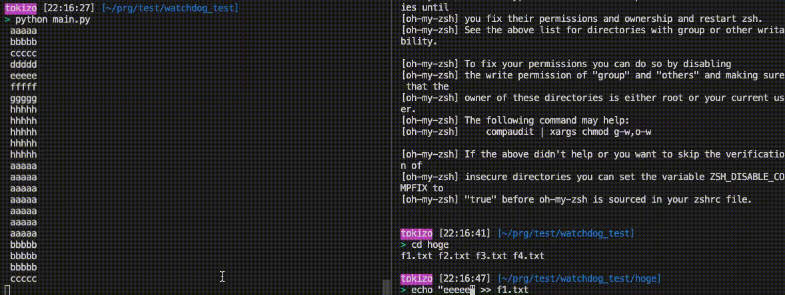

  
`tail -f` 便利。  
  
<!--more-->  
  
## 開発環境  
```bash
> python --version
Python 3.8.5

> pip list | grep -e watchdog -e pandas
pandas          1.1.3
watchdog        0.10.3
```
  
## Watchdog  
[gorakhargosh/watchdog](https://github.com/gorakhargosh/watchdog)  
ファイルシステムイベントを監視するためのPythonライブラリ。  
  
## tail -f  
ログファイルなどの監視に用いるコマンド。  
対象のファイルが追加されるたびに出力の末尾に追加表示する。  
  
今回はWatchdogを使って `tail -f` を真似てみた。  
  
## コード
  
```python
import time
import pandas as pd
from watchdog.observers import Observer
from watchdog.events import PatternMatchingEventHandler

DIRECTORY = './hoge/'
FILE = 'f1.txt'
PATH = DIRECTORY + FILE

len_df = -1

class TextFileEventHandler(PatternMatchingEventHandler):
    def __init__(self, patterns=['*.txt'], ignore_patterns=None, ignore_directories=True, case_sensitive=False):
        super().__init__(patterns, ignore_patterns, ignore_directories, case_sensitive)
   
    # 監視対象のファイルに変更があった時に実行
    def on_modified(self, event):
        # 指定のファイル以外は弾いておく
        if event.src_path[-len(FILE):] != FILE:
            return
        
        bef_len_df = len_df
        df = save_len_df()
        print_df(df=df, start=bef_len_df)

# ファイルの行数を保存
def save_len_df():
    df = pd.read_csv(PATH, header=None)
    len_df = len(df)
    return df

def print_df(df, start):
    print(df[start:].to_string(index=False, header=None))

def main():
    # ファイル内容すべて出力, 行番号取得
    df = save_len_df()
    print(df.to_string(index=False, header=None))

    # 監視
    observer = Observer()
    observer.schedule(TextFileEventHandler(), DIRECTORY, recursive = False)    
    observer.start()

    try:
        while True:
            time.sleep(5)
    except KeyboardInterrupt:
        observer.unschedule_all()
        observer.stop()

main()
```
  
　
  
ObjectsのAttributesの一覧を `dir(<object>)` で出せるの知らなかった。  
  
```python
import pandas as pd

df = pd.read_csv("./hoge/f1.txt")
print(dir(df))
# [..., 'to_stata', 'to_string', 'to_timestamp', ...]
```
  
## 動作確認
  

  
ファイルに追加された際に、差分が追加で出力されている。  
  
## 参考  
- [【 head 】コマンド／【 tail 】コマンド――長いメッセージやテキストファイルの先頭だけ／末尾だけを表示する：Linux基本コマンドTips（3） - ＠IT](https://www.atmarkit.co.jp/ait/articles/1603/07/news023.html)
- [gorakhargosh/watchdog: Python library and shell utilities to monitor filesystem events.](https://github.com/gorakhargosh/watchdog)  
- [Watchdog — watchdog 0.10.3 documentation](https://python-watchdog.readthedocs.io/en/v0.10.3/)  
- [python - How to get a complete list of object's methods and attributes? - Stack Overflow](https://stackoverflow.com/questions/191010/how-to-get-a-complete-list-of-objects-methods-and-attributes)  