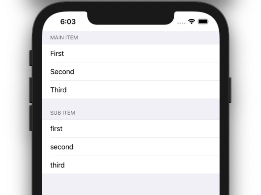

  
iOS14.0以降の UICollectionView の取り扱い方法が結構変わってるので追っていく。  
  
<!--more-->  
  
## 開発環境  
  
```bash
> xcodebuild -version
Xcode 12.3
Build version 12C33
```
  
## UICollectionViewListCell
iOS14.0以降で使用可能。  
  
> A collection view cell that provides list features and default styling.  
> [UICollectionViewListCell | Apple Developer Documentation](https://developer.apple.com/documentation/uikit/uicollectionviewlistcell)  
  
リスト機能を提供する UICollectionViewCell。  
  
[Implementing Modern Collection Views](https://developer.apple.com/documentation/uikit/views_and_controls/collection_views/implementing_modern_collection_views)を参考にコードを書いていく。  
  
## スクリーンショット  
  
  
  
## コード
  
```swift
import UIKit

private enum Section: Hashable {
    case main
    case sub
}

private struct Item: Hashable {
    let title: String?
    
    init(title: String?) {
        self.title = title
    }
    
    private let identifier = UUID()
    
    static let mainItem: [Item] = [
        Item(title: "Main Item"),  // Header
        Item(title: "First"),
        Item(title: "Second"),
        Item(title: "Third")
    ]
    
    static let subItem: [Item] = [
        Item(title: "Sub Item"),  // Header
        Item(title: "first"),
        Item(title: "second"),
        Item(title: "third")
    ]
}

final class ViewController: UIViewController {

    @IBOutlet weak var collectionView: UICollectionView!
    
    private var dataSource: UICollectionViewDiffableDataSource<Section, Item>! = nil

    override func viewDidLoad() {
        super.viewDidLoad()
        
        configureCollectionViewLayout()
        configureCollectionViewDataSource()
    }
    
    private func configureCollectionViewLayout() {
        var layoutConfiguration = UICollectionLayoutListConfiguration(appearance: .grouped)
        layoutConfiguration.headerMode = .firstItemInSection
        let layout = UICollectionViewCompositionalLayout.list(using: layoutConfiguration)
        collectionView.collectionViewLayout = layout
    }
    
    private func configureCollectionViewDataSource() {
        let cellRegistration = UICollectionView.CellRegistration<UICollectionViewListCell, Item> { cell, _, item in
            var contentConfiguration = cell.defaultContentConfiguration()
            contentConfiguration.text = item.title
            cell.contentConfiguration = contentConfiguration
        }
        
        dataSource = UICollectionViewDiffableDataSource<Section, Item>(collectionView: collectionView) {
            (collectionView, indexPath, item) -> UICollectionViewCell? in
            return collectionView.dequeueConfiguredReusableCell(using: cellRegistration, for: indexPath, item: item)
        }
        
        var snapshot = NSDiffableDataSourceSnapshot<Section, Item>()
        snapshot.appendSections([.main, .sub])
        snapshot.appendItems(Item.mainItem, toSection: .main)
        snapshot.appendItems(Item.subItem, toSection: .sub)
        dataSource.apply(snapshot, animatingDifferences: false)
    }
}
```
  
## UICollectionView.CellRegistration  
  
```swift
let cellRegistration = UICollectionView.CellRegistration<UICollectionViewListCell, Item> { cell, _, item in
    var contentConfiguration = cell.defaultContentConfiguration()
    contentConfiguration.text = item.title
    cell.contentConfiguration = contentConfiguration
}
```
  
iOS14.0以降で使用可能。  
  
> A registration for the collection view’s cells.  
> [UICollectionView.CellRegistration | Apple Developer Documentation](https://developer.apple.com/documentation/uikit/uicollectionview/cellregistration)  
  
以前は生の文字列でcellを指定する必要があった。  
タイポの解決策として [R.swift](https://github.com/mac-cain13/R.swift) で扱いやすくしていたが、標準の CellRegistration を用いることでよりタイポの心配がなくなった。  
  
## UICollectionViewDiffableDataSource  
  
```swift
dataSource = UICollectionViewDiffableDataSource<Section, Item>(collectionView: collectionView) {
    (collectionView, indexPath, item) -> UICollectionViewCell? in
    return collectionView.dequeueConfiguredReusableCell(using: cellRegistration, for: indexPath, item: item)
}
```
  
iOS13.0以降で使用可能。  
  
> The object you use to manage data and provide cells for a collection view.  
> [UICollectionViewDiffableDataSource | Apple Developer Documentation](https://developer.apple.com/documentation/uikit/uicollectionviewdiffabledatasource)  

UICollectionViewDataSource に準拠している。  
各セルを構成し、データの表示方法を決定する。  
  
## NSDiffableDataSourceSnapshot  
  
```swift
var snapshot = NSDiffableDataSourceSnapshot<Section, Item>()
snapshot.appendSections([.main, .sub])
snapshot.appendItems(Item.mainItem, toSection: .main)
snapshot.appendItems(Item.subItem, toSection: .sub)
dataSource.apply(snapshot, animatingDifferences: false)
```
  
iOS13.0以降で使用可能。  
  
> A representation of the state of the data in a view at a specific point in time.  
> [NSDiffableDataSourceSnapshot | Apple Developer Documentation](https://developer.apple.com/documentation/uikit/nsdiffabledatasourcesnapshot)  
  
Diffable data sources (UICollectionViewDiffableDataSource) を使用する時は、 NSDiffableDataSourceSnapshot を使用して UICollectionView にデータを提供する。  
データとは、表示するセクションとアイテムで構成されるものを指す。  
  
---
  
[今まで](https://tokizuoh.dev/posts/bb40ng5vc3vnn30q/)と比べて、以下が良い点だと感じた。  
  
- UICollectionViewDatasource などの複数の protocol を ViewController に準拠させる必要がなくなり、比較的コードが短くなった点  
- UICollectionView.CellRegistration により、セル登録時のタイポのことを考える必要がなくなった点  
  
逆に、以下に上記のコードの改善点をあげた。  
  
- Section Header を Item 内の先頭要素としているが、Item とは別で切り出したい。とはいえ、`.firstItemInSection` という case があるということは Apple 的に推奨しているのかもしれない。  
  
まだまだ、UICollectionView 周りで知らない知識が多いので引き続き追っていく。  
  
## 参考  
  
- [Implementing Modern Collection Views | Apple Developer Documentation](https://developer.apple.com/documentation/uikit/views_and_controls/collection_views/implementing_modern_collection_views)  
- [UICollectionViewListCell | Apple Developer Documentation](https://developer.apple.com/documentation/uikit/uicollectionviewlistcell)  
- [UICollectionViewDiffableDataSource | Apple Developer Documentation](https://developer.apple.com/documentation/uikit/uicollectionviewdiffabledatasource)  
- [UICollectionView.CellRegistration | Apple Developer Documentation](https://developer.apple.com/documentation/uikit/uicollectionview/cellregistration)  
- [NSDiffableDataSourceSnapshot | Apple Developer Documentation](https://developer.apple.com/documentation/uikit/nsdiffabledatasourcesnapshot)  
- [mac-cain13/R.swift: Strong typed, autocompleted resources like images, fonts and segues in Swift projects](https://github.com/mac-cain13/R.swift)  
- [iOS 14: UICollectionView を使って UITableView を置換します - Qiita](https://qiita.com/MaShunzhe/items/0bf7723e39df7d578e68)  