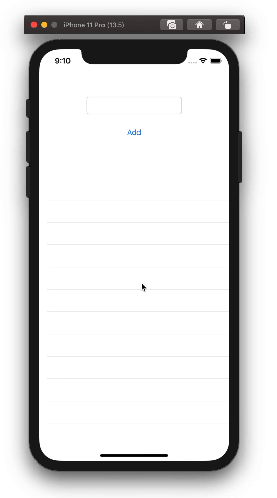

  
永続化、響きがかっこいい。  
<!--more-->  
## Realm  
  
  
  
([Realm: Create reactive mobile apps in a fraction of the time](https://realm.io/) より)  
  
　
  
> Realm is an open source object database management system, initially for mobile operating systems (Android/iOS) but also available for platforms such as Xamarin React Native, and others, including desktop applications (Windows), and is licensed under the Apache License.
  
([Realm (database) - Wikipedia](https://en.wikipedia.org/wiki/Realm_(database)) より)  
  
モバイル向けのデータベース管理システム。  
  
## 開発環境  
  
```bash
Xcode: Version 11.5 (11E608c)  
Apple Swift version 5.2.4 (swiftlang-1103.0.32.9 clang-1103.0.32.53)
Target: x86_64-apple-darwin19.5.0
```
  
## 最小構成で試運転  
UITextFieldにて受け取った文字列をRealmに保存するコードを書いてみる。  
pod周りは 「[Realm: リアクティブなモバイルアプリを短期間に > インストール > CocoaPods](https://realm.io/jp/docs/swift/latest/)」 の通りに実行。  
  
1. UITextFieldで文字列の入力受付  
2. UIButton押下  
3. Realmに文字列を保存  
4. UITableViewに今まで受け取った文字列を反映  
  
  
  
　
  
```swift
import UIKit
import RealmSwift

class ItemModel: Object {
    @objc dynamic var item: String? = nil
}

class ViewController: UIViewController {
    
    @IBOutlet weak var textField: UITextField!
    @IBOutlet weak var tableView: UITableView!

    var itemList: Results<ItemModel>!
    
    override func viewDidLoad() {
        super.viewDidLoad()
        
        let realm = try! Realm()
        itemList = realm.objects(ItemModel.self)
        
        tableView.dataSource = self
    }
    
    @IBAction func add(_ sender: Any) {
        let item = ItemModel()
        item.item = textField.text
        
        let realm = try! Realm()
        
        try! realm.write {
            realm.add(item)
        }
        textField.text?.removeAll()
        
        self.tableView.reloadData()
    }
}

extension ViewController: UITableViewDataSource {
    func tableView(_ tableView: UITableView, numberOfRowsInSection section: Int) -> Int {
        return itemList.count
    }
    
    func tableView(_ tableView: UITableView, cellForRowAt indexPath: IndexPath) -> UITableViewCell {
        let cell: UITableViewCell = tableView.dequeueReusableCell(withIdentifier: "cell", for: indexPath)
        cell.textLabel?.text = itemList[indexPath.row].item
        return cell
    }
}

```
  
　
  
```swift
class ItemModel: Object {
    @objc dynamic var item: String? = nil
}
```
  
「[Realm: リアクティブなモバイルアプリを短期間に](https://realm.io/jp/docs/swift/latest/)」の通り、モデルの変数には `dynamic` が必要。（Objective-C が絡むときに必要な修飾子らしい）  
  
　
  
```swift
print(Realm.Configuration.defaultConfiguration.fileURL!)
```
  
データベースはアプリキルで揮発されない。  
保存先は上記コードで確認できる。  
  
　
  
```swift
// データベースに格納されてる全ての値
let allItem = realm.objects(ItemModel.self)

// filterでフィルタリング
let filteredItem = allItem.filter({ (item) -> Bool in
    item.item?.count == 4
})
```
  
格納されている値も簡単に取得できる。  
  
　
  
アプリの全体で値を持たせたい場合は、少量なら static property に 紐付けているが、複雑になる場合や量が多くなる時はRealmを使う方が効率的かもしれない。  
  
# 参考  
- [Realm: Create reactive mobile apps in a fraction of the time](https://realm.io/)  
- [Realm (database) - Wikipedia](https://en.wikipedia.org/wiki/Realm_(database))  
- [realm/realm-cocoa: Realm is a mobile database: a replacement for Core Data & SQLite](https://github.com/realm/realm-cocoa)  