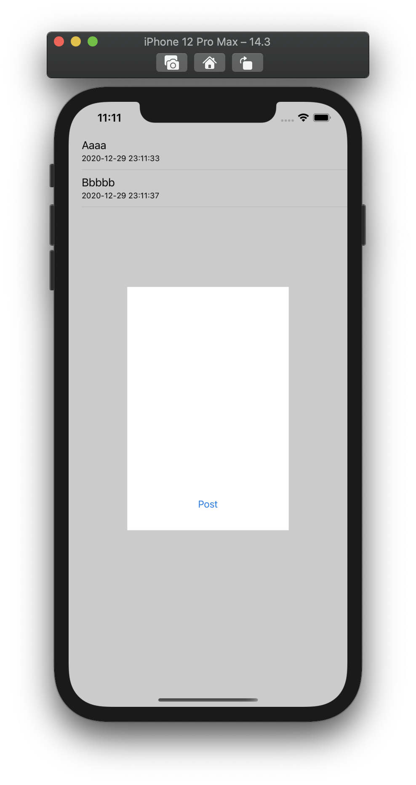

  
<!--more-->  
  
## 開発環境  
  
```bash
> xcodebuild -version
Xcode 12.3
Build version 12C33
```
  
## 動作  
  
  
  
## 画面一覧  
  
| 一覧 | 入力フォーム |
| ---- | ---- |
|  |  |
  
## コード  
  
#### ViewController (一覧)  
  
```swift
import UIKit

class ViewController: UIViewController {
    
    class ViewModel {
        var posts: [Post] = []
    }
    
    struct Post {
        let title: String
        let date: Date
    }
    
    let viewModel = ViewModel()
    
    @IBOutlet weak var tableView: UITableView!
    
    @IBAction func post(_ sender: Any) {
        let vc = self.storyboard?.instantiateViewController(identifier: "postViewController") as! PostViewController
        vc.viewModel = viewModel
        vc.modalPresentationStyle = .overFullScreen
        vc.modalTransitionStyle = .crossDissolve
        self.present(vc, animated: true)
    }
    
    override func viewDidLoad() {
        super.viewDidLoad()
        tableView.tableFooterView = UIView(frame: .zero)
        tableView.dataSource = self
    }
    
    override func viewWillAppear(_ animated: Bool) {
        super.viewWillAppear(animated)
        tableView.reloadData()
    }
}

extension ViewController: UITableViewDataSource {
    func tableView(_ tableView: UITableView, numberOfRowsInSection section: Int) -> Int {
        return viewModel.posts.count
    }
    
    func tableView(_ tableView: UITableView, cellForRowAt indexPath: IndexPath) -> UITableViewCell {
        let cell = UITableViewCell(style: .subtitle, reuseIdentifier: "subtitle")
        cell.textLabel?.text = viewModel.posts[indexPath.row].title
        cell.detailTextLabel?.text = dateToString(date: viewModel.posts[indexPath.row].date)
        return cell
    }
}

extension ViewController {
    func dateToString(date: Date) -> String {
        let dateFormatter = DateFormatter()
        dateFormatter.dateFormat = "yyyy-MM-dd HH:mm:ss"
        return dateFormatter.string(from: date)
    }
}

```
  
#### PostViewController (入力フォーム)  
  
```swift
import UIKit

class PostViewController: UIViewController {
    
    @IBOutlet weak var popUpView: UIView!
    @IBOutlet weak var textView: UITextView!
    
    var viewModel: ViewController.ViewModel?
    
    override func viewDidLoad() {
        super.viewDidLoad()
    }
    
    // full screenでこのVCに遷移 → dismiss → viewWillAppear が呼ばれないので対応 (詳しくは参考文献へ)
    override func viewWillAppear(_ animated: Bool) {
        presentingViewController?.beginAppearanceTransition(false, animated: animated)
        super.viewWillAppear(animated)
    }
    
    override func viewDidAppear(_ animated: Bool) {
        super.viewDidAppear(animated)
        presentingViewController?.endAppearanceTransition()
    }
    
    override func viewWillDisappear(_ animated: Bool) {
        super.viewWillDisappear(animated)
        presentingViewController?.beginAppearanceTransition(true, animated: animated)
        presentingViewController?.endAppearanceTransition()
    }
    
    // 内部でポップアップしているView以外の領域タップ時の処理を記述
    override func touchesBegan(_ touches: Set<UITouch>, with event: UIEvent?) {
        if !popUpView.frame.contains(touches.first!.location(in: view)) {
            guard textView.text.count > 0 else {
                self.dismiss(animated: true, completion: nil)
                return
            }
            showAlert {
                self.dismiss(animated: true, completion: nil)
            }
            
        }
    }
    
    private func showAlert(completion: @escaping (() -> Void)) {
        let dialog = UIAlertController(title: "入力が途中です",
                                       message: "dismissしますか？",
                                       preferredStyle: .alert)
        dialog.addAction(UIAlertAction(title: "キャンセル", style: .cancel, handler: nil))
        dialog.addAction(UIAlertAction(title: "Yes", style: .default, handler: { (_) in
            completion()
        }))
        self.present(dialog, animated: true, completion: nil)
    }
    
    @IBAction func post(_ sender: Any) {
        guard textView.text.count > 0 else {
            return
        }
        
        let post = ViewController.Post(title: textView.text,
                                       date: Date())
        viewModel?.posts.append(post)
        dismiss(animated: true)
    }    
}

```
  
## ポイント  
  
- 任意のViewのタップ検知  
- full screen遷移時の遷移元viewWillAppear呼び出し
  
## 参考  
  
- [detailTextLabel | Apple Developer Documentation](https://developer.apple.com/documentation/uikit/uitableviewcell/1623273-detailtextlabel) (iOS14.0でDeprecated)  
- [(begin|end)AppearanceTransition()の挙動を見る - カルボナーラ街道](https://tokizuoh.dev/posts/egmoxngp6yk2hh28/)  
  