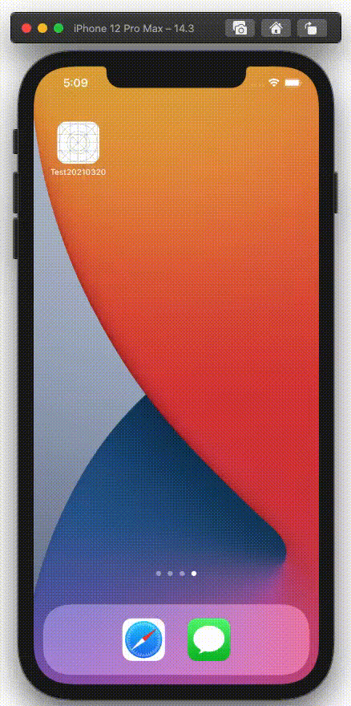

  
<!--more-->  
  
## 開発環境  
  
```bash
> xcodebuild -version
Xcode 12.3
Build version 12C33
```
  
## gif  
  
  
  
## コード
  
```swift
import UIKit

final class ViewController: UIViewController {
    
    @IBOutlet weak var collectionView: UICollectionView!

    private let itemSpasing: CGFloat = 10
    private let displayCellCount: CGFloat = 3
    private let cellCount: Int = 10
    
    private lazy var seen: [Bool] = Array(repeating: false, count: self.cellCount)
    
    override func viewDidLoad() {
        super.viewDidLoad()
        setupCollectionView()
    }
    
    private func setupCollectionView() {
        collectionView.dataSource = self
        collectionView.delegate = self
        
        let layout = UICollectionViewFlowLayout()
        let availableWidth = view.bounds.width - (displayCellCount - 1) * itemSpasing
        layout.itemSize = CGSize(width: Int(availableWidth) / Int(displayCellCount), height: 100)
        layout.scrollDirection = .horizontal
        layout.minimumInteritemSpacing = itemSpasing
        collectionView.collectionViewLayout = layout
    }
}

extension ViewController: UICollectionViewDataSource {
    func collectionView(_ collectionView: UICollectionView, numberOfItemsInSection section: Int) -> Int {
        return cellCount
    }
    
    func collectionView(_ collectionView: UICollectionView, cellForItemAt indexPath: IndexPath) -> UICollectionViewCell {
        let cell = collectionView.dequeueReusableCell(withReuseIdentifier: "cell", for: indexPath)
        cell.backgroundColor = (indexPath.row % 2 == 0 ? .red : .blue)
        return cell
    }
}

extension ViewController: UICollectionViewDelegate {
    func collectionView(_ collectionView: UICollectionView, willDisplay cell: UICollectionViewCell, forItemAt indexPath: IndexPath) {
        guard !seen[indexPath.row] else {
            return
        }
        seen[indexPath.row] = true
        
        cell.transform = CGAffineTransform(translationX: 450 * (CGFloat(indexPath.row + 1) * 0.1), y: 0)
        UIView.animate(withDuration: 0.5) {
            cell.transform = CGAffineTransform(translationX: 0, y: 0)
        }
    }
}
```
  
`cell.transform` に指定するviewの位置は相対的な位置。親viewから計算して位置を決めなくて良いので、楽にアニメーションを組むことができる。  
  