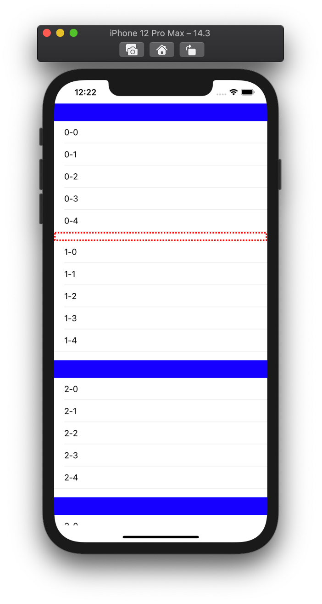
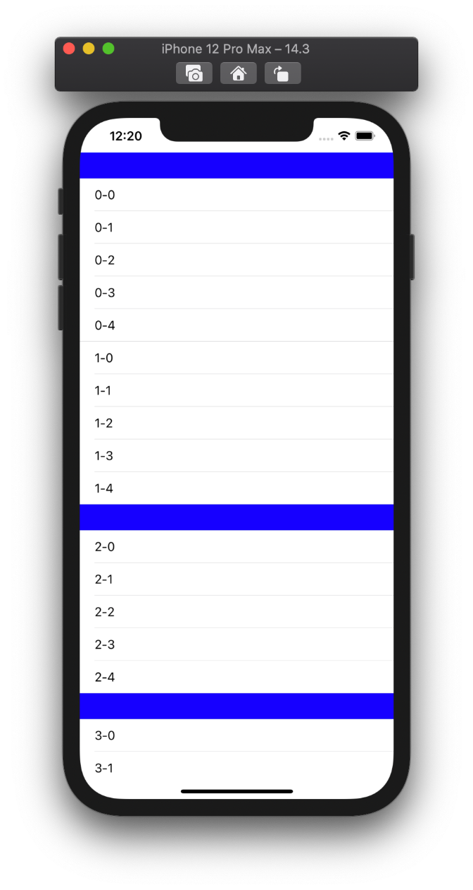
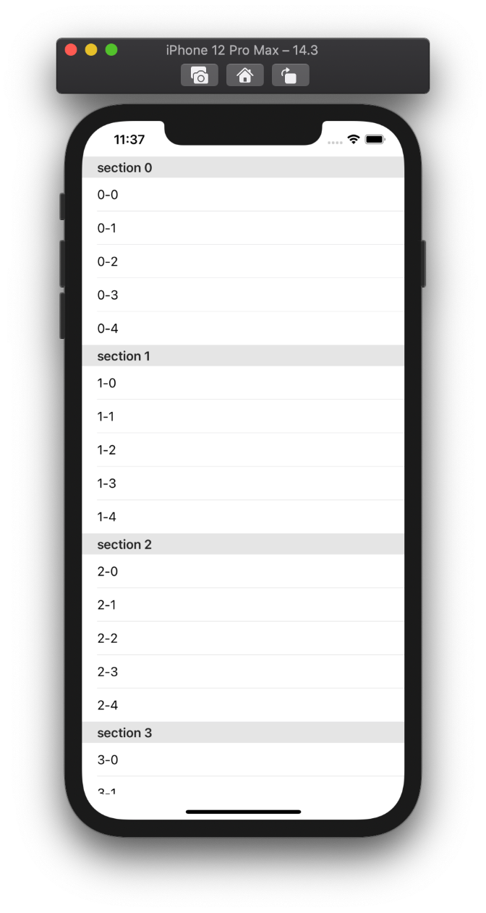
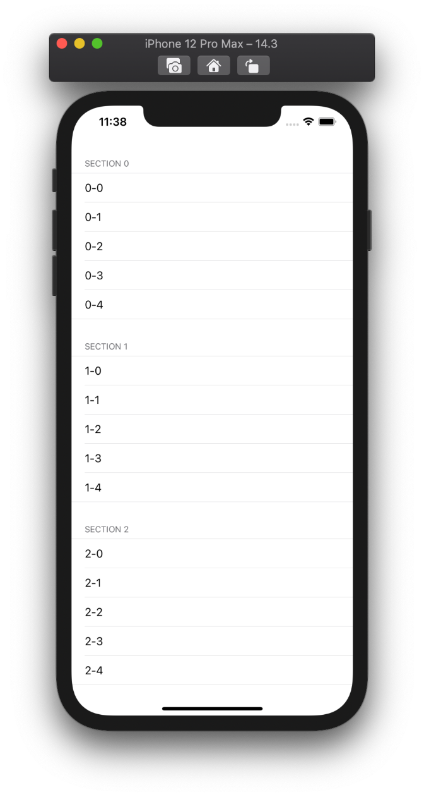
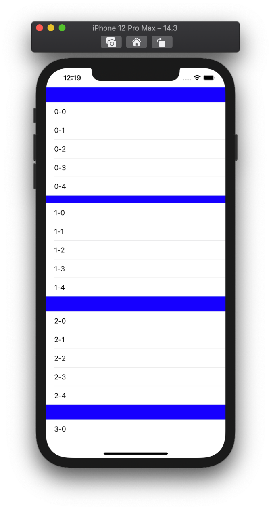

  
0は0ではない。  
  
<!--more-->  
  
## 開発環境  
  
```bash
> xcodebuild -version
Xcode 12.3
Build version 12C33
```
  
## 要約  
  
Q. UITableViewのstyleがGroupedの時、特定のセクションヘッダーを表示したくない場合どうすれば良い？  
  
A. `heightForHeaderInSection` で `.leastNonzeroMagnitude` を返す。  
  
```swift
// section1のヘッダーを表示したくない場合
func tableView(_ tableView: UITableView, heightForHeaderInSection section: Int) -> CGFloat {
    return section == 1 ? .leastNonzeroMagnitude : 35
}
```
  
　
  
`heightForHeaderInSection` の設定のみの場合、直前のセクションフッターが残ってる関係で、`heightForFooterInSection` も合わせて設定すると、完全にセクション間のマージンを0にできる。  
  
| heightForHeaderInSectionのみ設定 | heightFor(Header/Footer)InSectionを設定 |
| ---- | ---- |
|  |  |
  
　
  
```swift
extension ViewController: UITableViewDelegate {
    func tableView(_ tableView: UITableView, heightForHeaderInSection section: Int) -> CGFloat {
        return section == 1 ? .leastNonzeroMagnitude : 35
    }
    
    func tableView(_ tableView: UITableView, heightForFooterInSection section: Int) -> CGFloat {
        return .leastNonzeroMagnitude
    }
}
```
  
## UITableViewのstyle  
  
| Plain | Grouped |
| ---- | ---- |
|  |  |
  
## heightForHeaderInSection
  
sectionが1の時の値を変更。  
  
| 0 | .leastNonzeroMagnitude |
| ---- | ---- |
|  |  |
  
0を指定しても完全に消しきれないので注意。  
ヘッダーの領域を完全に消したい場合は、`.leastNonzeroMagnitude`を返そう。  
  