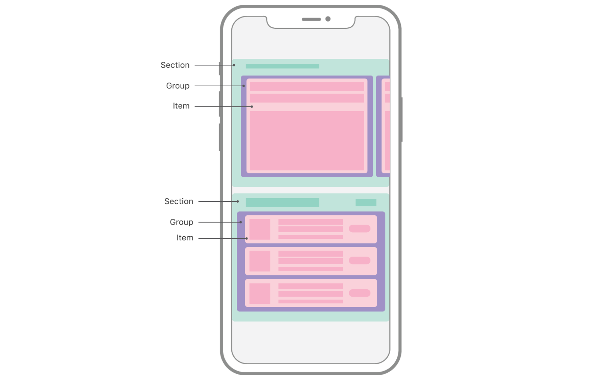
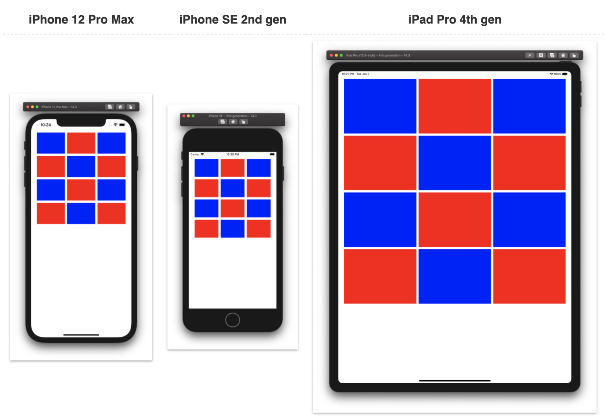
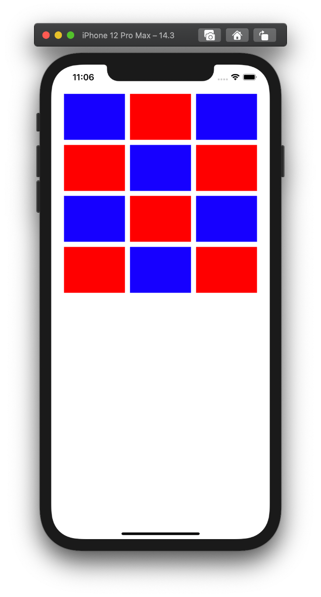
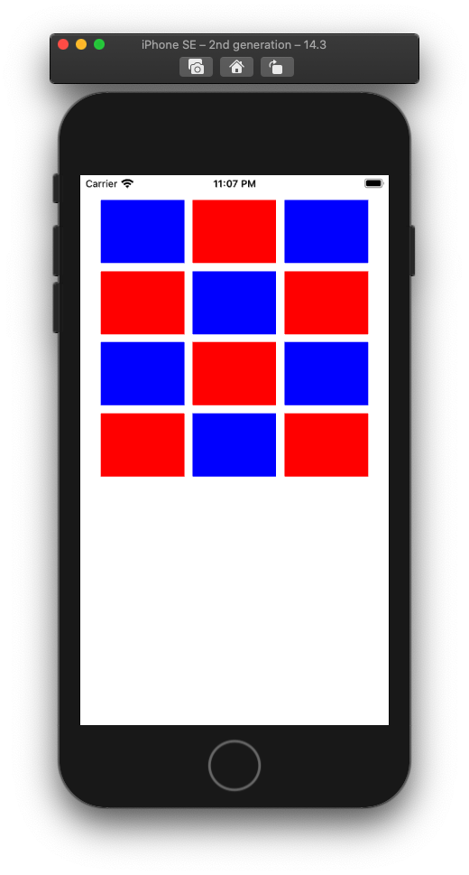
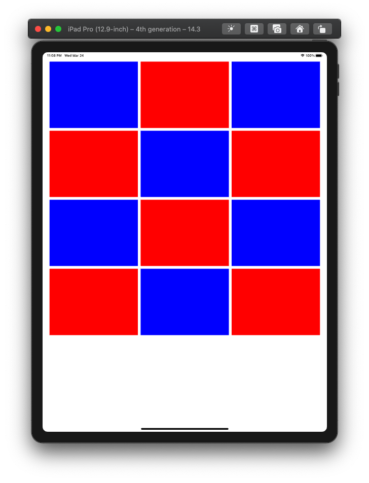

  
命名が長い。  
<!--more-->  
  
## 開発環境  
  
```bash
> xcodebuild -version
Xcode 12.3
Build version 12C33
```
  
## UICollectionViewCompositionalLayout  
  
命名から分かるが UICollectionViewLayout のサブクラス。  
  
> A layout object that lets you combine items in highly adaptive and flexible visual arrangements.
> [UICollectionViewCompositionalLayout](https://developer.apple.com/documentation/uikit/uicollectionviewcompositionallayout)  
  
適応性が高く柔軟な視覚的配置でアイテムを組み合わせることができるレイアウトオブジェクト。  
  
　
  
  
  
> You combine the components by building up from items into a group, from groups into a section, and finally into a full layout, like in this example of a basic list layout:  
> [UICollectionViewCompositionalLayout](https://developer.apple.com/documentation/uikit/uicollectionviewcompositionallayout)  
  
Item -> Group -> Section とレイアウトを構築することによって、コンポーネントを結合する。  
下の階層から段階的にレイアウトを組んでいくイメージ。  
  
## お題  
  
  
[UICollectionViewの列数と行数を端末サイズ関係なく実装する - カルボナーラ街道](https://tokizuoh.dev/posts/bx1rn3hnd6cjghqh/)  
  
上記で UICollectionViewFlowLayout を用いて組んだレイアウトを UICollectionViewCompositionalLayout を使って似せてみる。  
  
## スクリーンショット
  
| iPhone 12 Pro Max | iPhone SE 2nd gen | iPad pro 4th gen |
| ---- | ---- | ---- |
|  |  |  |
  
結構似せることができた。  
  
## コード  
  
```swift
import UIKit

final class ViewController: UIViewController {
    @IBOutlet weak var collectionView: UICollectionView! {
        didSet {
            collectionView.dataSource = self
        }
    }
    
    override func viewDidLoad() {
        super.viewDidLoad()
    }
    
    override func viewWillLayoutSubviews() {
        super.viewWillLayoutSubviews()
        collectionView.collectionViewLayout = layout()
    }
}

extension ViewController {
    private func layout() -> UICollectionViewCompositionalLayout {
        let sideMargin: CGFloat = 25
        let interItemSpacing: CGFloat = 10
        let horizontalItemCount: CGFloat = 3
        
        let availableWidth = collectionView.frame.width - sideMargin * 2 - (horizontalItemCount - 1) * interItemSpacing
        let itemWidth = availableWidth / horizontalItemCount
        
        // Item
        let itemSize = NSCollectionLayoutSize(widthDimension: .absolute(itemWidth),
                                              heightDimension: .fractionalHeight(1.0))
        let item = NSCollectionLayoutItem(layoutSize: itemSize)
        
        // Group
        let groupSize = NSCollectionLayoutSize(widthDimension: .fractionalWidth(1.0),
                                               heightDimension: .absolute(itemWidth * 3 / 4))
        let group = NSCollectionLayoutGroup.horizontal(layoutSize: groupSize,
                                                       subitems: [item])
        group.interItemSpacing = .fixed(interItemSpacing)
        
        
        // Section
        let section = NSCollectionLayoutSection(group: group)
        section.interGroupSpacing = 10
        section.contentInsets = NSDirectionalEdgeInsets(top: 10,
                                                        leading: sideMargin,
                                                        bottom: 10,
                                                        trailing: sideMargin)
        
        let layout = UICollectionViewCompositionalLayout(section: section)
        return layout
    }
}

extension ViewController: UICollectionViewDataSource {
    func numberOfSections(in collectionView: UICollectionView) -> Int {
        return 1
    }
    
    func collectionView(_ collectionView: UICollectionView, numberOfItemsInSection section: Int) -> Int {
        return 12
    }
    
    func collectionView(_ collectionView: UICollectionView, cellForItemAt indexPath: IndexPath) -> UICollectionViewCell {
        let cell = collectionView.dequeueReusableCell(withReuseIdentifier: "cell", for: indexPath)
        cell.backgroundColor = (indexPath.row % 2 == 0 ? .blue : .red)
        return cell
    }
}

```
  
## 小ネタ
  
レイアウト計算は viewDidLoad() 内ではなく、[viewWillLayoutSubviews()](https://developer.apple.com/documentation/uikit/uiviewcontroller/1621437-viewwilllayoutsubviews) 内で記述したほうが良さそう。  
collectionViewのframe.widthがライフサイクルメソッド別で異なるので、subViewのレイアウト直前に呼ばれる viewWillLayoutSubviews() の中でレイアウト計算をしよう。  
  
## 参考  
  
- [UICollectionViewCompositionalLayout | Apple Developer Documentation](https://developer.apple.com/documentation/uikit/uicollectionviewcompositionallayout)  
- [UICollectionViewCompositionalLayoutConfiguration | Apple Developer Documentation](https://developer.apple.com/documentation/uikit/uicollectionviewcompositionallayoutconfiguration)  
- [Advances in Collection View Layout - WWDC 2019 - Videos - Apple Developer](https://developer.apple.com/videos/play/wwdc2019/215/)  
- [春の入門祭り 🌸 #13 Swift Compositional Layouts入門：複雑なCollectionViewをシンプルに実装する | フューチャー技術ブログ](https://future-architect.github.io/articles/20200617/)  
- [時代の変化に応じて進化するCollectionView ~Compositional LayoutsとDiffable Data Sources~ - Qiita](https://qiita.com/shiz/items/a6032543a237bf2e1d19)  