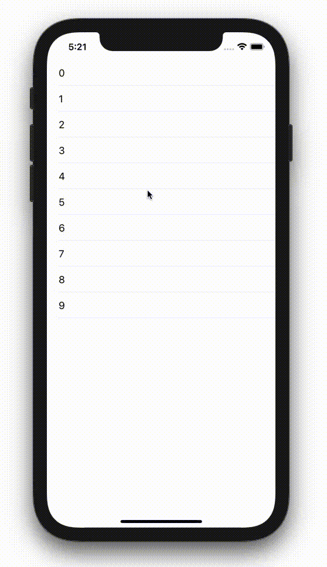
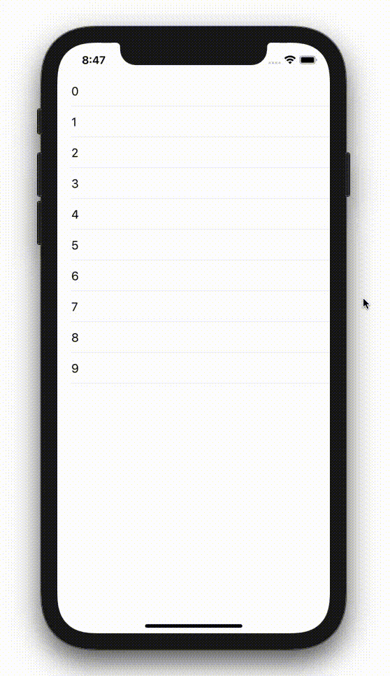

  
<!--more-->  
  
## 開発環境  
  
```bash
> xcodebuild -version 
Xcode 12.3
Build version 12C33
```
  
## シンプル  
  
  
  
```swift
import UIKit

class ViewController: UIViewController {

    @IBOutlet weak var tableView: UITableView!
    
    var array = [Int](0..<10)
    
    override func viewDidLoad() {
        super.viewDidLoad()
        
        tableView.dataSource = self
        tableView.tableFooterView = UIView(frame: .zero)
    }
}
extension ViewController: UITableViewDataSource {
    func tableView(_ tableView: UITableView, numberOfRowsInSection section: Int) -> Int {
        return array.count
    }
    
    func tableView(_ tableView: UITableView, cellForRowAt indexPath: IndexPath) -> UITableViewCell {
        let cell = UITableViewCell()
        cell.textLabel?.text = String(array[indexPath.row])
        return cell
    }
    
    func tableView(_ tableView: UITableView, canEditRowAt indexPath: IndexPath) -> Bool {
        return true
    }
    
    func tableView(_ tableView: UITableView, commit editingStyle: UITableViewCell.EditingStyle, forRowAt indexPath: IndexPath) {
        switch editingStyle {
        case .delete:
            array.remove(at: indexPath.row)
            tableView.beginUpdates()
            tableView.deleteRows(at: [indexPath], with: .automatic)
            tableView.endUpdates()
        case .insert, .none:
            // NOP
            break
        }
    }
}
```
  
## trailingSwipe  
  
  
  
```swift
import UIKit

class ViewController: UIViewController {

    @IBOutlet weak var tableView: UITableView!
    
    var array = [Int](0..<10)
    
    override func viewDidLoad() {
        super.viewDidLoad()
        
        tableView.dataSource = self
        tableView.delegate = self
        tableView.tableFooterView = UIView(frame: .zero)
    }
}

extension ViewController: UITableViewDelegate {
    func tableView(_ tableView: UITableView, trailingSwipeActionsConfigurationForRowAt indexPath: IndexPath) -> UISwipeActionsConfiguration? {
        let action = UIContextualAction(style: .destructive,
                                        title: "消すで！") { (action, view, completionHandler) in
            self.showAlert(deleteIndexPath: indexPath)
            completionHandler(true)
        }
        action.backgroundColor = .orange
        let configuration = UISwipeActionsConfiguration(actions: [action])
        return configuration
    }
    
    func showAlert(deleteIndexPath indexPath: IndexPath) {
        let dialog = UIAlertController(title: "セル消すで！",
                                       message: "ほんまに消してええんか？",
                                       preferredStyle: .alert)
        dialog.addAction(UIAlertAction(title: "消す", style: .default, handler: { (_) in
            self.array.remove(at: indexPath.row)
            self.tableView.deleteRows(at: [indexPath], with: .automatic)
        }))
        dialog.addAction(UIAlertAction(title: "嫌や", style: .cancel, handler: nil))
        self.present(dialog, animated: true, completion: nil)
    }
}

extension ViewController: UITableViewDataSource {
    func tableView(_ tableView: UITableView, numberOfRowsInSection section: Int) -> Int {
        return array.count
    }
    
    func tableView(_ tableView: UITableView, cellForRowAt indexPath: IndexPath) -> UITableViewCell {
        let cell = UITableViewCell()
        cell.textLabel?.text = String(array[indexPath.row])
        return cell
    }
    
    func tableView(_ tableView: UITableView, canEditRowAt indexPath: IndexPath) -> Bool {
        return true
    }
}

```
  