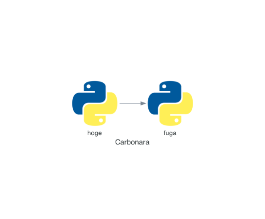
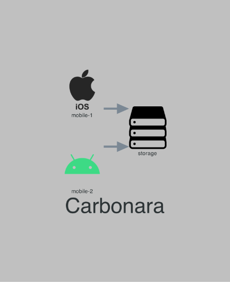
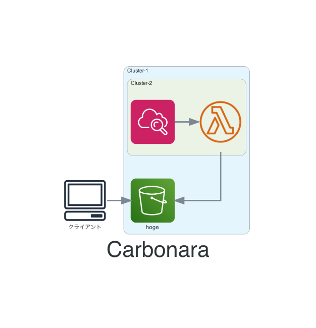

  
Python で書けるので慣れてる人は書きやすい。  
  
<!--more-->  
  
## 開発環境  
  
```bash
> python3 -V
Python 3.9.0

> pip list | grep diagrams
diagrams               0.19.1

> brew info graphviz
graphviz: stable 2.47.1 (bottled), ...
```
  
## Diagram
  
> Diagrams lets you draw the cloud system architecture in Python code.  
> [Diagrams · Diagram as Code](https://diagrams.mingrammer.com/)  
  
Diagram を使うことで Python でクラウドシステムアーキテクチャを描画できる。  
  
AWS, Azure, GCP などのサービスに加え、プログラミング言語やフレームワークもサポートしているので、幅広くシステム構成図が書けそう。  
  
## セットアップ  
  
[Graphviz](https://graphviz.gitlab.io/download/) を事前にインストールしておく。  
今回は brew でインストールした。  
  
```bash
> brew install graphviz

> pip install diagrams
```
  
## 書いてみた  
  

  
　
  
```python
from diagrams import Diagram
from diagrams.programming.language import Python

with Diagram("Carbonara", show=False):
    Python("hoge") >> Python("fuga")
```
  
## 書いてみた 2
  
  
  
　
  
```python
from diagrams import Diagram
from diagrams.generic.os import IOS
from diagrams.generic.os import Android
from diagrams.generic.storage import Storage

graph_attr = {
    "fontsize": "50",
    "bgcolor": "gray"
}

edge_attr = {
    'arrowsize': '2.0',
    'penwidth': '5.0'
}

with Diagram("Carbonara", show=False, graph_attr=graph_attr, edge_attr=edge_attr):
    [IOS("mobile-1"),
    Android("mobile-2")] >> Storage("storage")
```
  
## 書いてみた 3
  
  
  
　
  
```python
from diagrams import Diagram, Cluster
from diagrams.aws.storage import S3
from diagrams.aws.compute import LambdaFunction
from diagrams.aws.management import Cloudwatch
from diagrams.onprem.client import Client

graph_attr = {
    "fontsize": "50",
}

edge_attr = {
    'arrowsize': '2.0',
    'penwidth': '3.0'
}

with Diagram("Carbonara", show=False, graph_attr=graph_attr, edge_attr=edge_attr):
    
    client = Client("クライアント")

    with Cluster("Cluster-1"):
        s3 = S3("hoge")
        client >> s3

        with Cluster("Cluster-2"):
            lambda_function = LambdaFunction()
            s3 << lambda_function
            Cloudwatch() >> lambda_function
```
  
## 感想
  
- コードなのでバージョン管理がしやすい  
- 個人の癖があまり出なさそうなので複数人利用時でも力を発揮しそう  
- Python 経験者なら苦なく書ける  
  
めっちゃ良い。  
  
## 参考  
  
- [Diagrams · Diagram as Code](https://diagrams.mingrammer.com/)  
- [Graphviz - Graph Visualization Software | Download](https://graphviz.gitlab.io/download/)  
  
