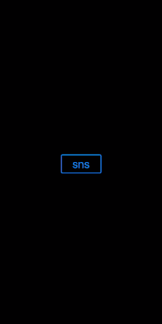

  
SNS共有。  
<!--more-->  
  
## UIActivityViewController  
テキストコピーなどのアクションや、SNSの共有などの処理が可能なViewController。  
  
## 開発環境  
  
```bash
Xcode: Version 11.6 (11E708)  
Apple Swift version 5.2.4 (swiftlang-1103.0.32.9 clang-1103.0.32.53)
Target: x86_64-apple-darwin19.6.0
```
  
## 最小構成で試運転  
UIButton押下でUIActivityViewControllerを表示させる。  
  
  
  
```swift
import UIKit

class ViewController: UIViewController {

    @IBOutlet weak var snsButton: UIButton!
    
    override func viewDidLoad() {
        super.viewDidLoad()
        
        // UIButtonの設定
        snsButton.layer.cornerRadius = 3.5
        snsButton.layer.borderWidth = 2
        snsButton.layer.borderColor = UIColor.systemBlue.cgColor
    }

    @IBAction func sns(_ sender: Any) {
        let text = "sample"
        let text2 = "sample2"
        let items = [text, text2]
        
        let activityVC = UIActivityViewController(activityItems: items,
                                                  applicationActivities: nil)
        present(activityVC, animated: true, completion: nil)
    }
    
}
```
  
## 参考  
- [UIActivityViewController | Apple Developer Documentation](https://developer.apple.com/documentation/uikit/uiactivityviewcontroller)  
- [iOS の Twitter シェア簡易実装 2019 - Qiita](https://qiita.com/kumamotone/items/c1fe3dd5718d29cc94d0#fn4)  