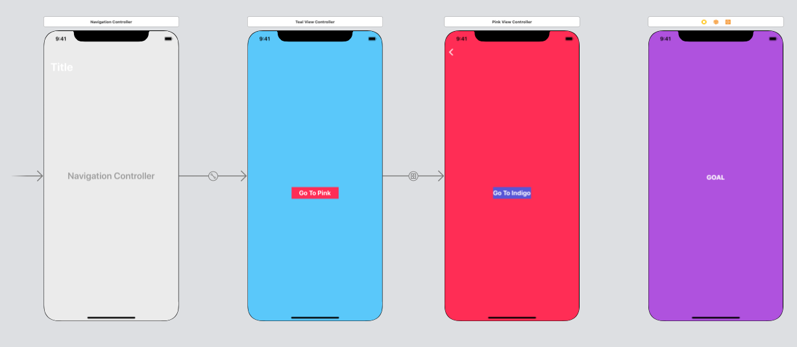

動画で UINavigationController を学んだ。  
<!--more-->  
  
## iOS Navigation Controller Tutorial | Xcode 11.4 Swift 5.2
[](https://www.youtube.com/watch?v=LbAd2FIlnos)
  
動画内での遷移は全てStoryboard上で行われていた。  
  
練習のため、コード上での遷移を追記してみる。  
  
## UINavigationController  
複数の表示内容を階層的（基本水平方向）にナビゲートするための Container View Controller。  
  
## 開発環境  
  
```bash
Xcode: Version 11.6 (11E708)  
Apple Swift version 5.2.4 (swiftlang-1103.0.32.9 clang-1103.0.32.53)
Target: x86_64-apple-darwin19.6.0
```
  
## Storyboard全体  
  

  
右端の ViewController を追加。(`IndigoViewController`)  
  
## コード上で遷移追加  
  
### IndigoViewController (遷移先)  
  
```swift
import UIKit

class IndigoViewController: UIViewController {

    override func viewDidLoad() {
        super.viewDidLoad()

        title = "Indigo Screen"
    }

}
```
  
NavigationItem の戻るボタンの文言の設定は遷移先ではなく、**遷移元**ViewController で行う。  
  
　
  
### PinkViewController (遷移元)  
  
```swift
import UIKit

class PinkViewController: UIViewController {

    override func viewDidLoad() {
        super.viewDidLoad()
        title = "Pink Screen"
    }
    

    @IBAction func goToIndigo(_ sender: Any) {
        let storyboard = UIStoryboard(name: "Main", bundle: nil)
        let indigoVC = storyboard.instantiateViewController(withIdentifier: "indigo") as! IndigoViewController
        navigationItem.backBarButtonItem?.title = ""
        navigationController?.pushViewController(indigoVC, animated: true)
    }

}
```
  
## 実行結果
  
  
  
Storyboard上でのみの遷移と比較して、Large Titleのアニメーションが異なる。  
  
## 参考  
- [iOS Navigation Controller Tutorial | Xcode 11.4 Swift 5.2 - YouTube](https://www.youtube.com/watch?v=LbAd2FIlnos)  
- [UINavigationController](https://developer.apple.com/documentation/uikit/uinavigationcontroller)  