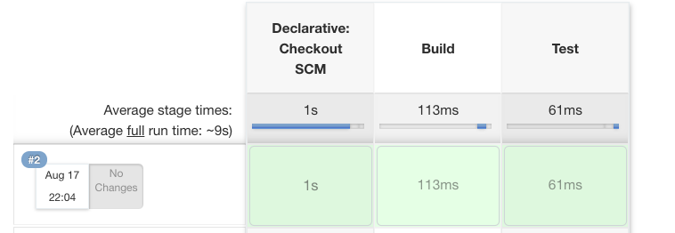

  
Jenkins で実行するシェルスクリプトのファイルサイズが大きくなり、良い分割方法を探していたところ、 Pipeline なるものがあったので使ってみる。  
  
<!--more-->  
  
## 開発環境  
  
```bash
> docker --version
Docker version 19.03.12, build 48a66213fe

> docker-compose --version
docker-compose version 1.27.2, build 18f557f9
```
  
## コード
  
https://github.com/tokizuoh/20210816  
  
## Pipeline を使うと嬉しいこと 
  
- Jenkinsfile の形式でジョブの内容をスクリプトとしてバージョン管理ができる
- 実行単位がステージごとになっていて失敗した箇所が分かりやすい
  
　
  
Jenkinsfile を書いてみる。  
  
## 最小構成
  
ステージ数2つでechoするだけの処理を書いた。  
  
#### Jenkinsfile
  
```
pipeline {
    agent any
    stages {
        stage('Build') {
            steps {
                echo "### Build Step ###"
            }
        }
        stage('Test') {
            steps {
                echo "### Test Step ###"
            }
        }
    }
}
```
  
#### 実行結果
  

  
この時点で感動した。各ステージごとに時間・実行結果が分かれていて視覚的に分かりやすい。  
  
## 関数の定義・実行
  
```
pipeline {
    agent any
    stages {
        stage('hoge') {
            steps {
                script {
                    def result = helloWorld()
                    echo result
                }
            }
        }
    }
}

def helloWorld() {
    return "Hello, World!"
}
```
  
Groovy の処理は script パイプライン内で行う必要がある。  
  
## シェルスクリプトの実行
  
```
pipeline {
    agent any
    stages {
        stage('Test') {
            steps {
                sh "chmod +x -R ${env.WORKSPACE}"
                sh("./test.sh")
            }
        }
    }
}

```
  
シェルスクリプトの権限付与はもう少し範囲絞ってやりたいが汎用的にしたいので今後の課題とする。  
  
## 参考  
  
- [Pipeline](https://www.jenkins.io/doc/book/pipeline/)  
- [Pipeline Syntax](https://www.jenkins.io/doc/book/pipeline/syntax/)  
  