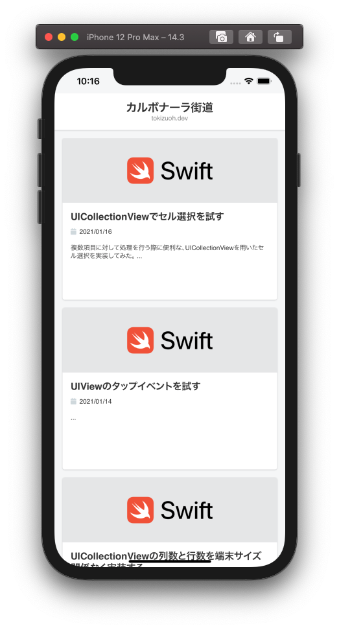
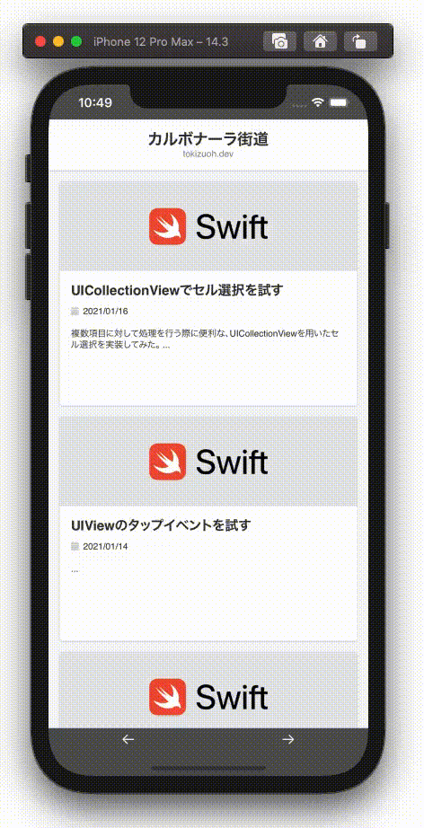
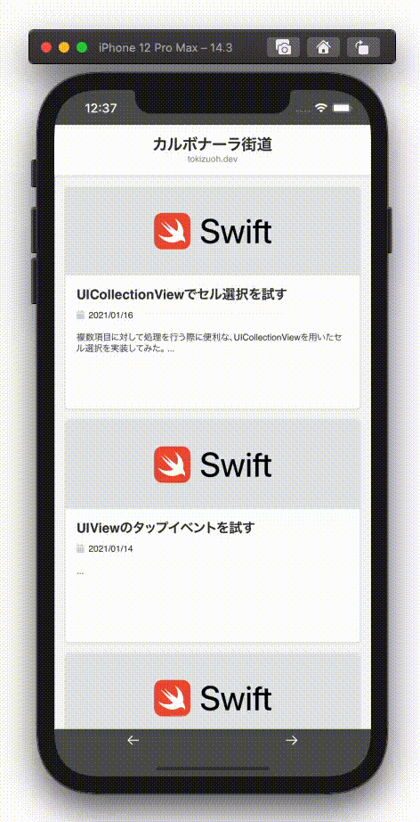

  
普段使ってるブラウザアプリがいかに使いやすく設計・実装されてるか分かった。  
<!--more-->  
  
## 開発環境  
  
```bash
> xcodebuild -version
Xcode 12.3
Build version 12C33
```
  
## 最小構成  
  
  
  
```swift
import UIKit
import WebKit

class ViewController: UIViewController {
    
    private var webView: WKWebView!

    override func viewDidLoad() {
        super.viewDidLoad()
        
        setupWebView()
    }
    
    private func setupWebView() {
        webView = WKWebView(frame: .zero, configuration: WKWebViewConfiguration())
        view.addSubview(webView)
        
        webView.translatesAutoresizingMaskIntoConstraints = false
        webView.centerXAnchor.constraint(equalTo: view.centerXAnchor).isActive = true
        webView.centerYAnchor.constraint(equalTo: view.centerYAnchor).isActive = true
        webView.widthAnchor.constraint(equalTo: view.widthAnchor).isActive = true
        webView.heightAnchor.constraint(equalTo: view.heightAnchor).isActive = true
 
        let url = URL(string: "https://tokizuoh.dev/")
        let request = URLRequest(url: url!)
        webView.load(request)
    }
}
```
  
この実装のままだと戻る/進むの処理が無いので加えていく。  
  
## 戻るボタン・進むボタンの追加  
  
  
  
```swift
import UIKit
import WebKit

class ViewController: UIViewController {
    
    private var webView: WKWebView!
    @IBOutlet weak var uiView: UIView!
    
    // 追加
    override var preferredStatusBarStyle: UIStatusBarStyle {
        return .lightContent
    }
    
    override func viewDidLoad() {
        super.viewDidLoad()
        
        setupWebView()

        // 追加
        view.backgroundColor = .darkGray
        
        // 追加
        setupSwipeActions()

    }
    
    private func setupWebView() {
        webView = WKWebView(frame: .zero, configuration: WKWebViewConfiguration())
        uiView.addSubview(webView)
        
        // 変更（制約の親view）
        webView.translatesAutoresizingMaskIntoConstraints = false
        webView.centerXAnchor.constraint(equalTo: uiView.centerXAnchor).isActive = true
        webView.centerYAnchor.constraint(equalTo: uiView.centerYAnchor).isActive = true
        webView.widthAnchor.constraint(equalTo: uiView.widthAnchor).isActive = true
        webView.heightAnchor.constraint(equalTo: uiView.heightAnchor).isActive = true
 
        let url = URL(string: "https://tokizuoh.dev/")
        let request = URLRequest(url: url!)
        webView.load(request)
    }
    
    // 追加
    private func setupSwipeActions() {
        let directions: [UISwipeGestureRecognizer.Direction] = [.left, .right]
        for direction in directions {
            let swipeGesture = UISwipeGestureRecognizer(target: self,
                                                        action: #selector(swipe(sender:)))
            swipeGesture.direction = direction
            uiView.addGestureRecognizer(swipeGesture)
        }
    }
    
    @IBAction @objc func goBack(_ sender: Any) {
        webView.goBack()
    }
    
    @IBAction func goForward(_ sender: Any) {
        webView.goForward()
    }
    
    // 追加
    @objc private func swipe(sender: UISwipeGestureRecognizer) {
        switch sender.direction {
        case .left:
            webView.goForward()
        case .right:
            webView.goBack()
        default:
            break
        }
    }
}
```
  
## 遷移先がアローリスト（allow list）に準拠しているか  
  
本ブログの記事をアローリストに追加し、ユーザーが遷移する時の遷移先URLがアローリストに含まれるかのチェック処理を追加。  
  
  
  
```swift
import UIKit
import WebKit

class ViewController: UIViewController {
    
    private var webView: WKWebView!
    @IBOutlet weak var uiView: UIView!
    
    override var preferredStatusBarStyle: UIStatusBarStyle {
        return .lightContent
    }
    
    // 追加
    private let allowList: [URL] = [
        // 「UICollectionViewでセル選択を試す」
        URL(string: "https://tokizuoh.dev/posts/es8hn6dx4bzrh15g/")!
    ]
    
    override func viewDidLoad() {
        super.viewDidLoad()
        
        setupWebView()
        view.backgroundColor = .darkGray
        
        setupSwipeActions()
        
        // 追加
        webView.navigationDelegate = self

    }
    
    private func setupWebView() {
        webView = WKWebView(frame: .zero, configuration: WKWebViewConfiguration())
        uiView.addSubview(webView)
        
        webView.translatesAutoresizingMaskIntoConstraints = false
        webView.centerXAnchor.constraint(equalTo: uiView.centerXAnchor).isActive = true
        webView.centerYAnchor.constraint(equalTo: uiView.centerYAnchor).isActive = true
        webView.widthAnchor.constraint(equalTo: uiView.widthAnchor).isActive = true
        webView.heightAnchor.constraint(equalTo: uiView.heightAnchor).isActive = true
 
        let url = URL(string: "https://tokizuoh.dev/")
        let request = URLRequest(url: url!)
        webView.load(request)
    }
    
    private func setupSwipeActions() {
        let directions: [UISwipeGestureRecognizer.Direction] = [.left, .right]
        for direction in directions {
            let swipeGesture = UISwipeGestureRecognizer(target: self,
                                                        action: #selector(swipe(sender:)))
            swipeGesture.direction = direction
            uiView.addGestureRecognizer(swipeGesture)
        }
    }
    
    @IBAction @objc func goBack(_ sender: Any) {
        webView.goBack()
    }
    
    @IBAction func goForward(_ sender: Any) {
        webView.goForward()
    }
    
    @objc private func swipe(sender: UISwipeGestureRecognizer) {
        switch sender.direction {
        case .left:
            webView.goForward()
        case .right:
            webView.goBack()
        default:
            break
        }
    }
}

// 追加
extension ViewController: WKNavigationDelegate {
    func webView(_ webView: WKWebView,
                 decidePolicyFor navigationAction: WKNavigationAction,
                 decisionHandler: @escaping (WKNavigationActionPolicy) -> Void) {
        switch navigationAction.navigationType {
        case .linkActivated:
            decideAction(navigationAction: navigationAction,
                         decisionHandler: decisionHandler)
        default:
            // ここでdecisionHandlerを実行しないとアプリが落ちる
            decisionHandler(.allow)
        }
    }
    
    private func decideAction(navigationAction: WKNavigationAction, decisionHandler: @escaping (WKNavigationActionPolicy) -> Void) {
        guard let url = navigationAction.request.url else {
            decisionHandler(.cancel)
            return
        }
        
        guard allowList.contains(url) else {
            decisionHandler(.cancel)
            return
        }
        
        decisionHandler(.allow)
    }
}
```
  
## 参考  
  
- [WKWebView | Apple Developer Documentation](https://developer.apple.com/documentation/webkit/wkwebview)  
- [iOSのステータスバーを自在に扱う - Qiita](https://qiita.com/fuwamaki/items/f623dbfde233a8b4f0d0)
  