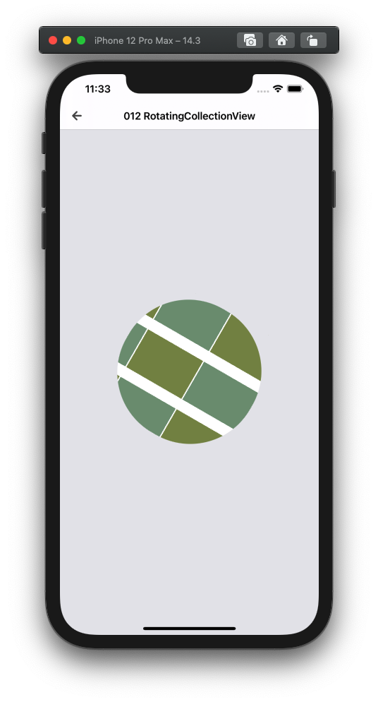

  
模様っぽいものを描画したかった、  
  
<!--more-->  
  
## 開発環境  
  
```bash
> xcodebuild -version
Xcode 12.3
Build version 12C33
```
  
## やること
  
- UIView (UICollectionView) を回転して別の UIView に埋め込む
  
## つくったもの  
  
  
  
竹感を出したかった。満足。  
  
## コード  
  
2つの UIViewController を作成した。  
  
- UICollectionView を埋め込む先の UIView を持つ UIViewController
- UICollectionView を生成する UIViewController
  
処理としては、UIView に UIViewController を埋め込んだあとに UIView を回転させている。  
  
#### UICollectionView を埋め込む先の UIView を持つ UIViewController
  
```swift
import UIKit

final class RotatingCollectionViewViewController: ComponentBaseViewController {

    @IBOutlet weak var foundationView: UIView! {
        didSet {
            // 円
            foundationView.layer.cornerRadius = foundationView.bounds.width / 2

            // タップ不可
            foundationView.isUserInteractionEnabled = false
        }
    }

    override func viewDidLoad() {
        super.viewDidLoad()

        configureNavigationItem(navigationTitle: "012 RotatingCollectionView",
                                blogURL: nil,
                                githubPRURL: nil)
        setupCollectionViewViewController()
    }

    private func setupCollectionViewViewController() {
        let vc = R.storyboard.rotatingCollectionViewComponent.rotatingCollectionViewComponent()!

        // foundationView の中身の View を foundationView 内に収まるように描画させる
        foundationView.clipsToBounds = true
        
        foundationView.addSubview(vc.view)
        foundationView.transform = CGAffineTransform(rotationAngle: CGFloat(Double.pi/1.5))
    }

}

```
  
#### UICollectionView を生成する UIViewController
  
```swift
import UIKit

// swiftlint:disable type_name
final class RotatingCollectionViewComponentViewController: UIViewController {

    @IBOutlet weak var collectionView: UICollectionView! {
        didSet {
            collectionView.dataSource = self
            collectionView.register(R.nib.rotatingCollectionViewCell)
        }
    }

    override func viewDidLoad() {
        setupCollectionView()
    }

}

extension RotatingCollectionViewComponentViewController {

    private func setupCollectionView() {
        let sideMargin: CGFloat = 30
        let cellCountsPerRow: CGFloat = 5
        let cellLineSpacing: CGFloat = 2

        let cellWidth: CGFloat = (view.bounds.width - (sideMargin * 2 + (cellCountsPerRow - 1) * cellLineSpacing)) / cellCountsPerRow
        let cellHeight: CGFloat = cellWidth * 86 / 59

        let layout: UICollectionViewFlowLayout = UICollectionViewFlowLayout()
        layout.minimumLineSpacing = cellLineSpacing
        layout.minimumInteritemSpacing = cellLineSpacing
        layout.itemSize = CGSize(width: cellWidth, height: cellHeight)

        collectionView.collectionViewLayout = layout
    }
}

extension RotatingCollectionViewComponentViewController: UICollectionViewDataSource {

    func collectionView(_ collectionView: UICollectionView, numberOfItemsInSection section: Int) -> Int {
        return 100
    }

    func collectionView(_ collectionView: UICollectionView, cellForItemAt indexPath: IndexPath) -> UICollectionViewCell {
        let cell = collectionView.dequeueReusableCell(withReuseIdentifier: R.reuseIdentifier.rotatingCollectionViewCell,
                                                      for: indexPath)!
        cell.backgroundColor = (indexPath.row % 2 == 0 ? R.color.bamboo_dark() : R.color.bamboo_light())
        return cell
    }

}

```
  
