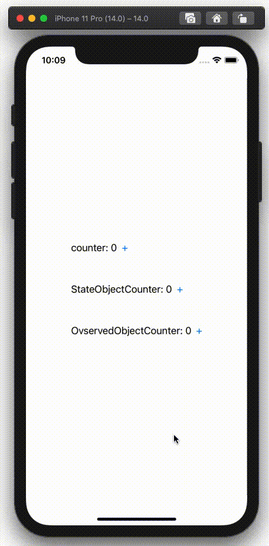
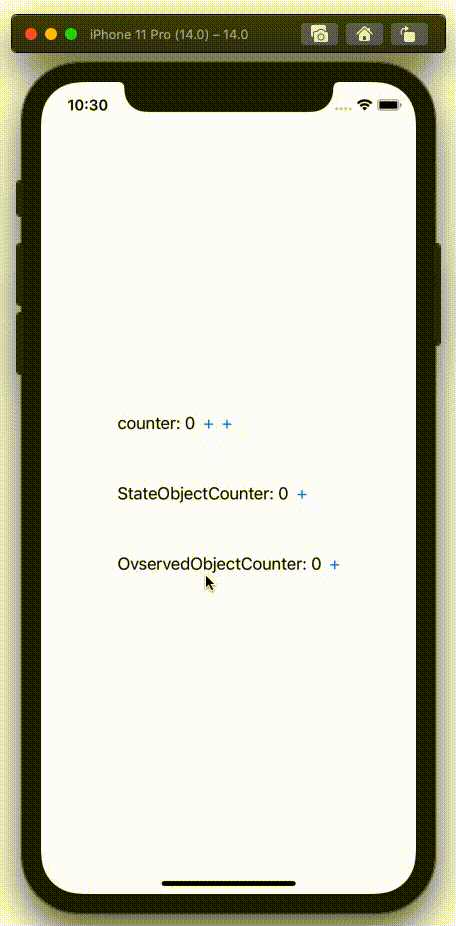

  
<!--more-->  
  
## 開発環境  
  
```bash
> xcodebuild -version
Xcode 12.0.1
Build version 12A7300
```
  
## スクリーンショット  
  

  
- counter (親View)
- StateObjectCounter (子View)
- OvservedObjectCounter (子View)
  
StateObjectCounterは親Viewのcounterが更新されても値を保持しているのに対し、OvservedObjectCounterは親Viewの値更新に伴い値が初期化されている。  
  
## コード  
  
```swift
import SwiftUI

struct ContentView: View {
    @State var counter = 0
    var body: some View {
        VStack(alignment: .leading, spacing: 50) {
            HStack {
                Text("counter: \(counter)")
                Button("+") {
                    counter += 1
                }
            }
            StateObjectCounter()
            ObservedObjectCounter()
        }
    }
}

final class Counter: ObservableObject {
    @Published var number = 0
}

struct StateObjectCounter: View {
    @StateObject private var counter = Counter()
    var body: some View {
        HStack {
            Text("StateObjectCounter: \(counter.number)")
            Button("+") {
                counter.number += 1
            }
        }
    }
}

struct ObservedObjectCounter: View {
    @ObservedObject private var counter = Counter()
    
    var body: some View {
        HStack {
            Text("OvservedObjectCounter: \(counter.number)")
            Button("+") {
                counter.number += 1
            }
        }
    }
}
```
## @StateObjectと@ObservedObjectの違い
ライフサイクルが異なる。
@ObservedObjectは親Viewが再描画される度（= 親Viewのプロパティが更新される度）に更新され、保持するViewが再描画される。  
  
　
  
---
以下別検証。  
  
## 親ViewのViewに関係ないプロパティが更新された場合
  
```swift
struct ContentView: View {
    @State var counter = 0
    @State var counter2 = 0  // 追加
    
    var body: some View {
        VStack(alignment: .leading, spacing: 50) {
            HStack {
                Text("counter: \(counter)")
                Button("+") {
                    counter += 1
                }
                Button("+") {
                    counter2 += 1  // 追加
                }
            }
            StateObjectCounter()
            ObservedObjectCounter()
        }
    }
}
```
  
　
  

  
　
  
Buttonでcounter2をインクリメントするが、View自体には関係ない。（counterはTextで使われている）  
この場合、counter2をインクリメントしてもViewに影響はないので更新はされず、必然的に親Viewの更新の度に生成される子ViewのObservedObjectCounterも新規生成されない。  
  
@Stateプロパティが更新される度にViewが更新されると思っていたが、Viewに関係のある@Stateプロパティが更新された場合にViewが更新される、という認識が正しそう。  
  
## 参考  
- [集まれSwift好き！Swift愛好会Vol.56/ 集まれKotlin好き！Kotlin愛好会 vol.26 @オンライン](https://www.youtube.com/watch?app=desktop&feature=youtu.be&v=FmqZSXlTDVA)
  