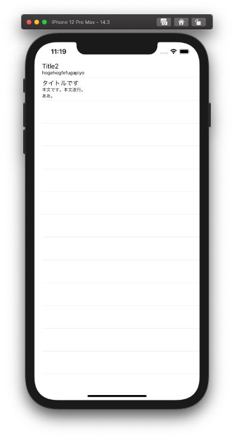

  
<!--more-->  
  
## 開発環境  
  
```bash
> xcodebuild -version
Xcode 12.3
Build version 12C33
```
  
## microCMSとは  
  
microCMSはAPIベースのヘッドレスCMS。  
ヘッドレスCMSによってフロントエンドとバックエンドを切り分けて設計できる。  
  
## スクリーンショット (microCMS)  
  
  
  
## スクリーンショット (シミュレータ)  
  
  
  
## コード
  
```swift
import UIKit

enum APIClientError: Error {
    case urlConversionError
    case requestError
}

struct Article: Codable {
    let contents: [Content]
    let totalCount: Int
    let offset: Int
    let limit: Int
}

struct Content: Codable {
    let id: String
    let createdAt: String
    let updatedAt: String
    let publishedAt: String
    let revisedAt: String
    let title: String
    let body: String
}

class APIClient {
    func request(urlString: String) -> Result<Article, APIClientError>{
        
        var article: Article?
        
        guard let url = URL(string: urlString) else {
            return .failure(.urlConversionError)
        }

        var request = URLRequest(url: url)
        request.setValue("{X-API-KEY}", forHTTPHeaderField: "X-API-KEY")
        request.httpMethod = "GET"
        
        let semaphore = DispatchSemaphore(value: 0)
        
        let task = URLSession.shared.dataTask(with: request) { (data, _, _) in
            if let data = data {
                do {
                    article = try? JSONDecoder().decode(Article.self, from: data)
                    semaphore.signal()
                } catch {
                    fatalError()
                }
            }
        }
        task.resume()
        
        // requestを待ってあげる
        semaphore.wait()
        return (article != nil) ? .success(article!) : .failure(.requestError)
    }
}

class ViewController: UIViewController {
    
    @IBOutlet weak var tableView: UITableView!
    
    var article: Article?
    let client = APIClient()
    
    override func viewDidLoad() {
        super.viewDidLoad()
        tableView.dataSource = self
        
        // request articles
        let result = client.request(urlString: "{エンドポイント}")
        switch result {
        case .success(let article):
            self.article = article
            tableView.reloadData()
            
        case .failure(let error):
            switch error {
            case .urlConversionError:
                break
            case .requestError:
                break
            }
        }
    }
}

extension ViewController: UITableViewDataSource {
    func tableView(_ tableView: UITableView, numberOfRowsInSection section: Int) -> Int {
        return article?.totalCount ?? 0
    }
    
    func tableView(_ tableView: UITableView, cellForRowAt indexPath: IndexPath) -> UITableViewCell {
        let cell = UITableViewCell(style: .subtitle, reuseIdentifier: "subTitle")
        
        var content = cell.defaultContentConfiguration()
        content.text = article?.contents[indexPath.row].title ?? ""
        content.secondaryText = article?.contents[indexPath.row].body ?? ""
        cell.contentConfiguration = content
        return cell
    }
}

```
  
microCMSすごい。  
  
ブログを一から作るとなると管理画面、記事エディタ、プレビュー...などやることが多くて挫折したことがあるが、microCMSを使えば側（がわ）だけ自分で作って裏はmicroCMS、という構成で実装をスムーズに行えそう。  
  
## 参考
  
- [microCMS | APIベースの日本製ヘッドレスCMS](https://microcms.io/)  
  