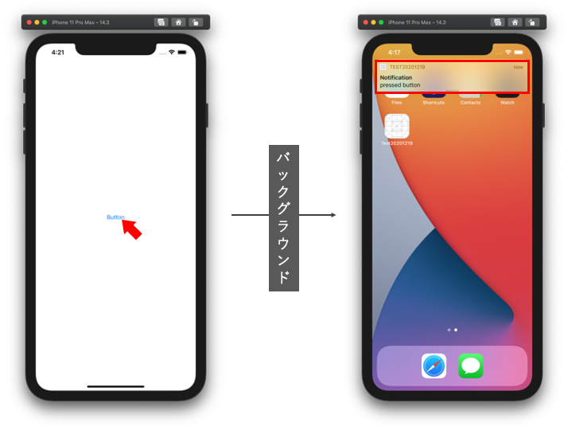

  
<!--more-->  
  
## 開発環境  
  
```bash
> xcodebuild -version  
Xcode 12.3
Build version 12C33
```
  
## 実装内容
  

  
- ボタン押下の5秒後に、アプリがバックグラウンドにいる時にローカル通知を実行
- 通知領域押下で特定の処理を実行
  
## コード
  
#### AppDelegate.swift
  
```swift
import UIKit
import Foundation

@main
class AppDelegate: UIResponder, UIApplicationDelegate {
    
    func application(_ application: UIApplication, didFinishLaunchingWithOptions launchOptions: [UIApplication.LaunchOptionsKey: Any]?) -> Bool {
        
        // 通知許諾の許諾を得る
        let center = UNUserNotificationCenter.current()
        center.requestAuthorization(options: [.alert]) { (granted, error) in
            if let _ = error {
                return
            }
            
            if granted {
                center.delegate = self
            } else {
                fatalError("通知拒否")
            }
        }
        
        return true
    }
    
    func application(_ application: UIApplication, configurationForConnecting connectingSceneSession: UISceneSession, options: UIScene.ConnectionOptions) -> UISceneConfiguration {
        return UISceneConfiguration(name: "Default Configuration", sessionRole: connectingSceneSession.role)
    }
    
    func application(_ application: UIApplication, didDiscardSceneSessions sceneSessions: Set<UISceneSession>) {
    }
}

extension AppDelegate: UNUserNotificationCenterDelegate {
    func userNotificationCenter(_ center: UNUserNotificationCenter, willPresent notification: UNNotification, withCompletionHandler completionHandler: @escaping (UNNotificationPresentationOptions) -> Void) {
        completionHandler([.badge, .sound, .alert])
    }
}
  
```
  
#### ViewController.swift
  
```swift
class ViewController: UIViewController {
    
    override func viewDidLoad() {
        super.viewDidLoad()
        setButton()
        
        // [A]
        NotificationCenter.default.addObserver(self,
                                               selector: #selector(printOne),
                                               name: UIApplication.willEnterForegroundNotification,
                                               object: nil)
        UNUserNotificationCenter.current().delegate = self
    }
    
    @objc func printOne() {
        // アプリ起動時や通常の遷移時も実行されるため、バックグラウンド復帰経由時に実行するようにフラグで分岐
        guard StateStore.isTransitedViaBackground else {
            return
        }
        StateStore.isTransitedViaBackground = false
        print(1)
    }
    
    func setButton() {
        let button = UIButton(type: .system)
        button.setTitle("Button", for: UIControl.State.normal)
        button.sizeToFit()
        button.center = self.view.center
        button.addTarget(self,
                         action: #selector(fireLocalPushNotification),
                         for: .touchUpInside)
        self.view.addSubview(button)
    }
    
    @objc func fireLocalPushNotification() {
        let content = UNMutableNotificationContent()
        content.title = "Notification"
        content.body = "pressed button"
        content.sound = UNNotificationSound.default
        let trigger = UNTimeIntervalNotificationTrigger(timeInterval: 5, repeats: false)
        let request = UNNotificationRequest(identifier: "immediately", content: content, trigger: trigger)
        UNUserNotificationCenter.current().add(request, withCompletionHandler: nil)
    }
}

extension ViewController: UNUserNotificationCenterDelegate {
    // 通知をタップしたときの処理　[A]よりも前に呼ばれる
    func userNotificationCenter(_ center: UNUserNotificationCenter, didReceive response: UNNotificationResponse, withCompletionHandler completionHandler: @escaping () -> Void) {
        StateStore.isTransitedViaBackground = true
        completionHandler()
    }
}

class StateStore {
    // バックグラウンド復帰かどうかを管理するフラグ
    static var isTransitedViaBackground: Bool = false
}
  
```
  