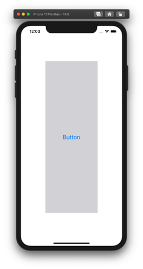
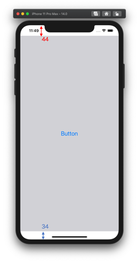

  
<!--more-->  
  
## 開発環境  
  
```bash
> xcodebuild -version
Xcode 12.0.1
Build version 12A7300
```
  
Simulator: iPhone 11 Pro Max  
  
## コード  
事前にUIButtonをSafe Area全面に配置しておいた。  
  
  
  
```swift
override func viewWillLayoutSubviews() {
    super.viewWillLayoutSubviews()
    additionalSafeAreaInsets = UIEdgeInsets(top: 100,
                                            left: 100,
                                            bottom: 100,
                                            right: 100)
    print(view.safeAreaInsets)  // UIEdgeInsets(top: 144.0, left: 100.0, bottom: 134.0, right: 100.0)
}
```
  
　
  
topに+44, bottomに+ 34されているが正常の動作。  
  
  
  
```swift
override func viewWillLayoutSubviews() {
    super.viewWillLayoutSubviews()
    print(view.safeAreaInsets)  // UIEdgeInsets(top: 44.0, left: 0.0, bottom: 34.0, right: 0.0)
}
```
  
## viewWillAppear() で行ってみた  
  
```swift
override func viewWillAppear(_ animated: Bool) {
    super.viewWillAppear(animated)
    additionalSafeAreaInsets = UIEdgeInsets(top: 100,
                                            left: 100,
                                            bottom: 100,
                                            right: 100)
    print(view.safeAreaInsets)  // UIEdgeInsets(top: 144.0, left: 100.0, bottom: 100.0, right: 100.0)
}
```
  
bottomに34が足されていない。  
`viewWillLayoutSubviews()` で行うのが良さそう。  
  
## 参考  
- [additionalSafeAreaInsets](https://developer.apple.com/documentation/uikit/uiviewcontroller/2902284-additionalsafeareainsets)
  