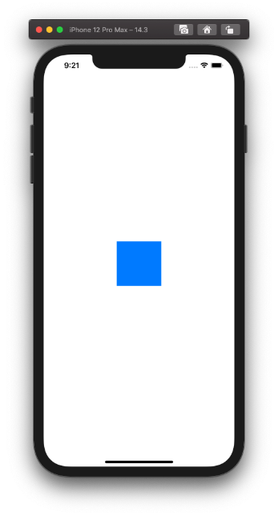
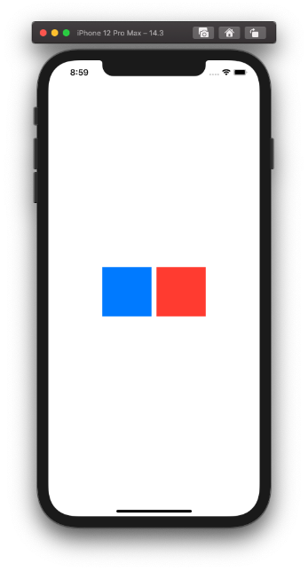
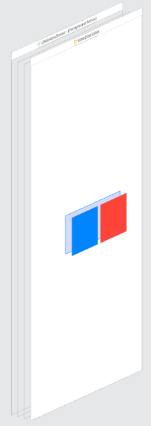

  
<!--more-->  
  
## 開発環境  
  
```bash
> xcodebuild -version
Xcode 12.3
Build version 12C33
```
  
## UIViewにタップイベントを追加
  
  
  
```swift
import UIKit

class ViewController: UIViewController {

    @IBOutlet weak var squareView: UIView!
    
    override func viewDidLoad() {
        super.viewDidLoad()
        
        let tapGestureRecognizer = UITapGestureRecognizer(target: self,
                                                          action: #selector(hoge))
        self.squareView.addGestureRecognizer(tapGestureRecognizer)
        
        
    }
    
    @objc private func hoge() {
        print(1)
    }
}

```
  
青いUIViewをタップすると`print(1)`が実行された。  
  
## タップイベントの無効化
UIViewには[isUserInteractionEnabled](https://developer.apple.com/documentation/uikit/uiview/1622577-isuserinteractionenabled)というプロパティが存在する。  
  
> A Boolean value that determines whether user events are ignored and removed from the event queue.  
> [isUserInteractionEnabled | Apple Developer Documentation](https://developer.apple.com/documentation/uikit/uiview/1622577-isuserinteractionenabled)  
  
ユーザーイベントを無視してイベントキューから削除するかどうかを決定する真偽値。デフォルトはtrueとなっている。  
（※ 一部のUIKitサブクラスはこのプロパティをオーバーライドし、異なるデフォルト値を返す。別の値を返すかどうかは、そのクラスのドキュメントを参照。）  
  
falseにして動きを見る。  
  
```swift
import UIKit

class ViewController: UIViewController {

    @IBOutlet weak var squareView: UIView!
    
    override func viewDidLoad() {
        super.viewDidLoad()
        
        // 追加
        squareView.isUserInteractionEnabled = false

        let tapGestureRecognizer = UITapGestureRecognizer(target: self,
                                                          action: #selector(hoge))
        self.squareView.addGestureRecognizer(tapGestureRecognizer)
        
        
    }
    
    @objc private func hoge() {
        print(1)
    }
}

```
  
タップしても何も起こらなかった。無効化されている。  
  
## UIStackViewにタップイベントを追加
  
UIViewをUIStackViewの子要素として配置した場合のタップイベントを試す。  
  
  
  
```swift
import UIKit

class ViewController: UIViewController {

    @IBOutlet weak var stackView: UIStackView!
    @IBOutlet weak var blueSquareView: UIView!
    @IBOutlet weak var redSquareView: UIView!
    
    override func viewDidLoad() {
        super.viewDidLoad()
        
        // UIStackViewをタップしたときの処理
        let stackTapGestureRecognizer = UITapGestureRecognizer(target: self,
                                                          action: #selector(printStack))
        self.stackView.addGestureRecognizer(stackTapGestureRecognizer)
        
        // 青いUIViewをタップしたときの処理（無効）
        blueSquareView.isUserInteractionEnabled = false
        let blueTapGestureRecognizer = UITapGestureRecognizer(target: self,
                                                          action: #selector(printBlue))
        self.blueSquareView.addGestureRecognizer(blueTapGestureRecognizer)
        
        // 赤いUIVIewをタップしたときの処理
        let redTapGestureRecognizer = UITapGestureRecognizer(target: self,
                                                          action: #selector(printRed))
        self.redSquareView.addGestureRecognizer(redTapGestureRecognizer)
    }
    
    @objc private func printStack() {
        print("stack")
    }
    
    @objc private func printBlue() {
        print("blue")
    }
    
    @objc private func printRed() {
        print("red")
    }
}
```
  
タップ結果は以下となった。  
  
- 青いUIViewタップ: `print("stack")`が実行された。  
- 赤いUIViewタップ: `print("red")`が実行された。  
  
　
  
  
  
ヒエラルキー上でUIStackViewは子要素の背面に存在するので、子要素（赤いUIView）のタップイベントが優先実行される。  
  
## 参考  
- [isUserInteractionEnabled | Apple Developer Documentation](https://developer.apple.com/documentation/uikit/uiview/1622577-isuserinteractionenabled)  
  