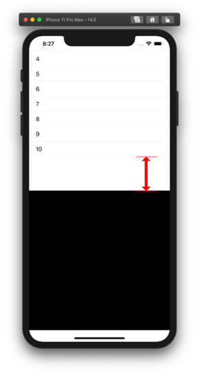

  
UIEdgeInsetsを使えばタイトルの内容が実装できるが、表示位置を変えているだけで、マージンを付与しているわけではない。  
<!--more-->  
  
## 開発環境  
  
```bash
> xcodebuild -version
Xcode 12.0.1
Build version 12A7300
```
  
## コード  
  
```swift
import UIKit

class ViewController: UIViewController {

    @IBOutlet weak var tableView: UITableView!
    
    let item = ["1", "2", "3", "4", "5", "6", "7", "8", "9", "10"]
    
    override func viewDidLoad() {
        super.viewDidLoad()
        
        tableView.dataSource = self
        tableView.contentInset = UIEdgeInsets(top: 0,
                                              left: 0,
                                              bottom: 100,  // ココ
                                              right: 0)
    }
}

extension ViewController: UITableViewDataSource {
    func tableView(_ tableView: UITableView, numberOfRowsInSection section: Int) -> Int {
        return item.count
    }
    
    func tableView(_ tableView: UITableView, cellForRowAt indexPath: IndexPath) -> UITableViewCell {
        let cell = UITableViewCell()
        cell.textLabel?.text = item[indexPath.row]
        return cell
    }
}
```
  
## スクリーンショット  
  
  
  
## 参考  
- [UIEdgeInsets | Apple Developer Documentation](https://developer.apple.com/documentation/uikit/uiedgeinsets)
  