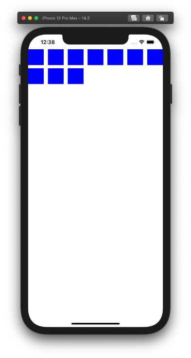
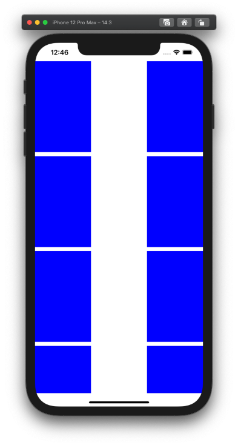
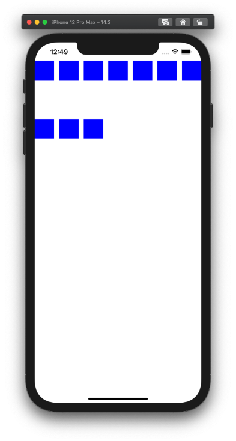
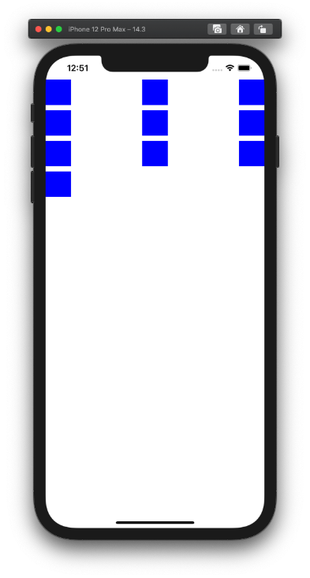
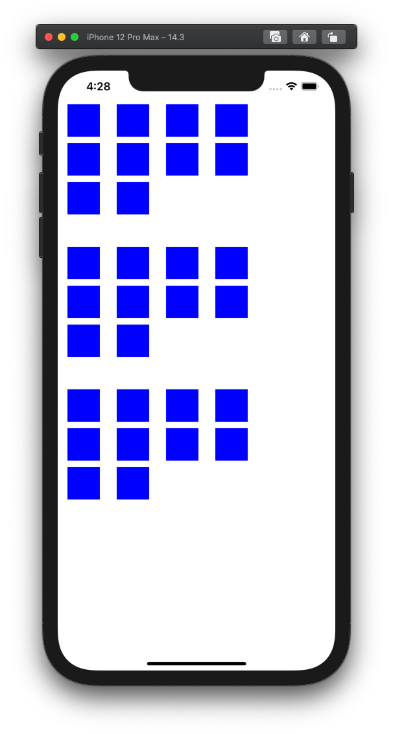
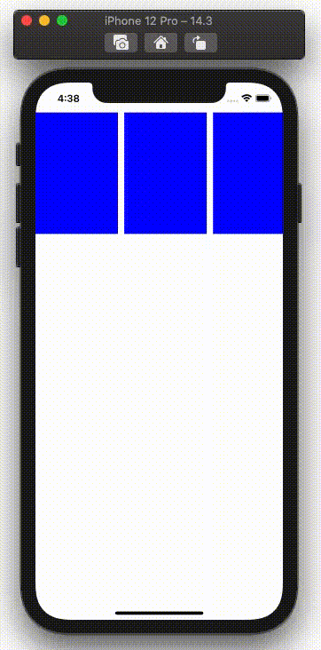

  
水平方向スクロールさせるViewによく使われる。  
可能な限りStoryboard上ではなくコードで設定を記述する。  
  
<!--more-->  
  
## 開発環境  
  
```bash
> xcodebuild -version
Xcode 12.3
Build version 12C33
```
  
## 最小構成  
  
  
  
```swift
import UIKit

class ViewController: UIViewController {

    @IBOutlet weak var collectionView: UICollectionView!
    
    override func viewDidLoad() {
        super.viewDidLoad()
        
        collectionView.dataSource = self
    }

}

extension ViewController: UICollectionViewDataSource {
    func collectionView(_ collectionView: UICollectionView, numberOfItemsInSection section: Int) -> Int {
        10
    }
    
    func collectionView(_ collectionView: UICollectionView, cellForItemAt indexPath: IndexPath) -> UICollectionViewCell {
        let cell = collectionView.dequeueReusableCell(withReuseIdentifier: "cell", for: indexPath)
        cell.backgroundColor = .blue
        return cell
    }
}

```
  
## セルの大きさ変更
  
  
  
```swift
override func viewDidLoad() {
    super.viewDidLoad()
    
    collectionView.dataSource = self
    
    let layout = UICollectionViewFlowLayout()
    layout.itemSize = CGSize(width: view.bounds.width / 3, height: view.bounds.height / 4)
    collectionView.collectionViewLayout = layout
}
```
  
## セル同士の間隔変更 (垂直方向)  
  
  
  
```swift
override func viewDidLoad() {
    super.viewDidLoad()
    
    collectionView.dataSource = self
    
    let layout = UICollectionViewFlowLayout()
    layout.minimumLineSpacing = 100
    collectionView.collectionViewLayout = layout
}
```
  
## セル同士の間隔変更 (水平方向)  
  
  
  
```swift
override func viewDidLoad() {
    super.viewDidLoad()
    
    collectionView.dataSource = self
    
    let layout = UICollectionViewFlowLayout()
    layout.minimumInteritemSpacing = 100
    collectionView.collectionViewLayout = layout
}
```
  
## section周りの余白  
  
  
  
```swift
import UIKit

class ViewController: UIViewController {

    @IBOutlet weak var collectionView: UICollectionView!
    
    override func viewDidLoad() {
        super.viewDidLoad()
        
        collectionView.dataSource = self
        
        let layout = UICollectionViewFlowLayout()
        layout.sectionInset = UIEdgeInsets(top: 5, left: 15, bottom: 45, right: 135)
        collectionView.collectionViewLayout = layout
    }

}

extension ViewController: UICollectionViewDataSource {
    func collectionView(_ collectionView: UICollectionView, numberOfItemsInSection section: Int) -> Int {
        10
    }
    
    func collectionView(_ collectionView: UICollectionView, cellForItemAt indexPath: IndexPath) -> UICollectionViewCell {
        let cell = collectionView.dequeueReusableCell(withReuseIdentifier: "cell", for: indexPath)
        cell.backgroundColor = .blue
        return cell
    }
    
    func numberOfSections(in collectionView: UICollectionView) -> Int {
        3
    }
}
```
  
垂直方向のセクション間はTop, Bottomの合算になる。  
  
## 横スクロール  
  
  
  
```swift
override func viewDidLoad() {
    super.viewDidLoad()
    
    collectionView.dataSource = self
    
    let layout = UICollectionViewFlowLayout()
    layout.scrollDirection = .horizontal
    layout.itemSize = CGSize(width: view.bounds.width / 3, height: view.bounds.height / 4)
    collectionView.collectionViewLayout = layout
}
```
  
## 参考  
  
- [UICollectionView再入門 - Qiita](https://qiita.com/takehilo/items/f7130693f5943c126f7e)  
  