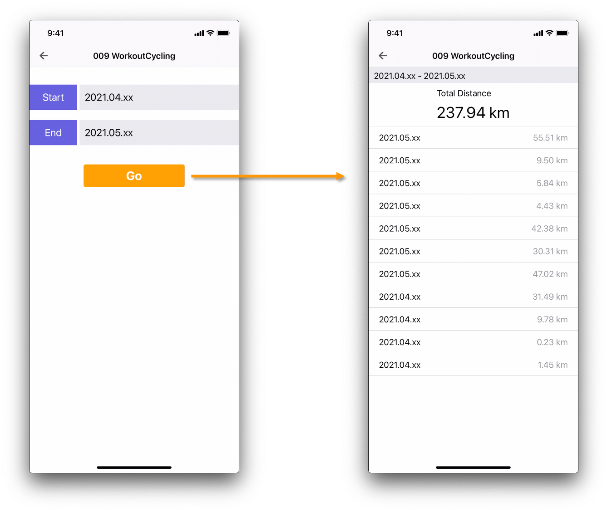

  
サイクリングの合計走行距離を楽に閲覧できるようにしたかった。  
  
<!--more-->  
  
## 開発環境  
  
```bash
> xcodebuild -version
Xcode 12.3
Build version 12C33
```
  
## やること
  
  
  
- [HealthKit](https://developer.apple.com/documentation/healthkit) からワークアウト（サイクリング）のデータを取得
- 取得したデータから各ワークアウトの走行距離を合算して、合計走行距離を表示
  
## つくったもの  
  
  
  
※ ブログ用に日付はボカしている
  
- 取得できたワークアウトの合計総合距離を表示
- 日毎の走行距離を表示
  
## コード  
  
[Pendula/Pendula/View/Component/009_WorkoutCyclingScene](https://github.com/tokizuoh/Pendula/tree/feature/%2371/Pendula/View/Component/009_WorkoutCyclingScene)  
※ 下の「つぎにやること」を書いてあるが、酷いコードになっている。  
  
#### HealthKit からワークアウトのデータを取得
  
```swift
private func configureHelathStore() {
    healthStore = HKHealthStore()
    let allTypes = Set([
        HKObjectType.workoutType()
    ])
    healthStore?.requestAuthorization(toShare: nil, read: allTypes) { success, _ in
        guard success else {
            return
        }
        self.getWorkouts()
    }
}

private func getWorkouts() {
    let type = HKWorkoutType.workoutType()
    let predicate = HKQuery.predicateForWorkouts(with: .cycling)
    let sortDescriptor = NSSortDescriptor(key: HKSampleSortIdentifierStartDate,
                                            ascending: false)
    let query = HKSampleQuery(sampleType: type,
                                predicate: predicate,
                                limit: HKObjectQueryNoLimit,
                                sortDescriptors: [sortDescriptor]) { _, samples, error in
        guard let workouts = samples as? [HKWorkout],
                error == nil else {
            return
        }
        self.workouts = workouts.sorted(by: { (lw, rw) -> Bool in
            lw.startDate < rw.startDate
        })
    }
    healthStore?.execute(query)
}
```
  
## つぎにやること
  
今回のコードは下記の点が **酷く** なるように書いた。  
  
- 流用性  
- 責務  
- テストのしやすさ
- etc...
  
というのも、今回書いたコードを元に、MVC や MVP などのアーキテクチャに沿って書き直す予定。  
一つのアーキテクチャごとに記事を書いていく。  
  
## 参考  
  
- [HealthKit | Apple Developer Documentation](https://developer.apple.com/documentation/healthkit)
- [HealthKitのガイドラインに関する更新 - ニュース - Apple Developer](https://developer.apple.com/jp/news/?id=04202020a)  
  