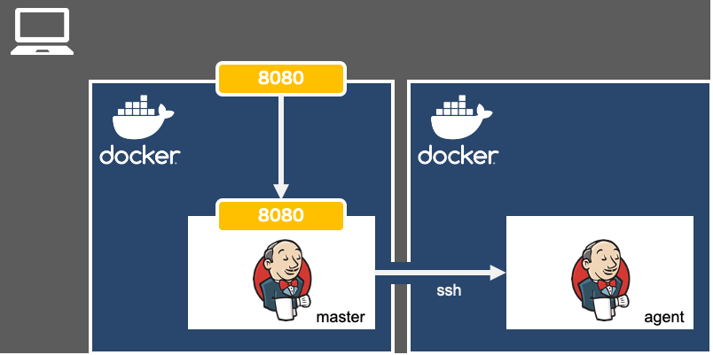

  
パワポ久しぶりに触った。  
<!--more-->  
  
## 構成  

  
## 開発環境  
  
```bash
> docker --version
Docker version 19.03.12, build 48a66213fe
```
  
## master の設定 1 / 2  
  
#### イメージ  
[jenkins/jenkins - Docker Hub](https://hub.docker.com/r/jenkins/jenkins)
  
　
  
#### コンテナの起動  
```bash
docker run -d -p 8080:8080 jenkins/jenkins
```
  
　
  
|オプション|内容           |備考                                                                    |
|:-------|:------------- |:----------------------------------------------------------------------|
|d       |デタッチド       |コンテナをバックグラウンドで起動。指定しないとターミナルがコンテナのログに専有される。|
|p       |ポートのマッピング|-p 8080:8080 （ホストマシンの8080ポートをコンテナの8080ポートにマップ）         |
  
　
  
> If you are only using SSH slaves, then you do NOT need to put that port mapping. (from [docker/README.md at master · jenkinsci/docker](https://github.com/jenkinsci/docker/blob/master/README.md))  
  
SSHでslaveと接続する場合は、専用にポートを解放する必要はない。  
  
　
  
#### Jenkinsの設定  
推奨プラグインのインストールを行い、適当なGitHubのリポジトリに紐付けたジョブを作成。  
  
> A Jenkins agent image which allows using SSH to establish the connection. It can be used together with the SSH Build Agents plugin or other similar plugins. (from [jenkinsci/docker-ssh-agent: Docker image for Jenkins agents connected over SSH](https://github.com/jenkinsci/docker-ssh-agent))
  
agentのDockerイメージは[SSH Build Agent](https://plugins.jenkins.io/ssh-slaves/)プラグインを使用するので、masterでインストールしておく。（今回は推奨プラグインで既にインストール済み）
  
　
  
#### 公開鍵・秘密鍵の設定  
masterからagentの通信をsshにするために、master側で公開鍵と秘密鍵を生成。  
  
```bash
ssh-keygen -t rsa
```
  
　
  
|オプション|内容     |備考                    |
|:-------|:------ |:-----------------------|
|t       |暗号化形式|rsa, dsa, ecdsa, ed25519|
  
## agent の設定  
  
#### イメージ (Dockerfile)  
```dockerfile
FROM jenkins/ssh-agent:latest

ENV JENKINS_AGENT_SSH_PUBKEY="{masterで生成した公開鍵}"
```
  
　
  
#### イメージの作成  
  
```bash
docker build . -t jenkins-agent-1
```
  
　
  
#### コンテナの起動  
  
```bash
docker run -d jenkins-agent-1 
```
  
　
  
#### コンテナIPの確認
```bash
root@{CONTAINER ID}:/home/jenkins# hostname -i
```
  
## master の設定 2 / 2 
  
#### Jenkinsの設定  
[Jenkinsの管理] > [ノードの管理] にて、 [新規ノード作成]を押下。  
  
|項目                            |内容                                            |
|:------------------------------|:-----------------------------------------------|
|ラベル                          |ジョブと紐付けるためのラベル（任意の値）               |
|ホスト                          |agentのIPアドレス                                 |
|認証情報                        |下記のユーザー名                                   |
|→ 種類                          |「SSH ユーザー名と秘密鍵」                         |
|→ ユーザー名                     |jenkins                                        |
|→ 秘密鍵                        |masterで作成した秘密鍵                            |
|→ パスフレーズ                   |masterで公開鍵・秘密鍵を作成した時に入力したパスフレーズ|
|Host Key Verification Strategy	|「Manualy trusted key Verification Strategy」   |
  
　
  
#### エラー: java.io.IOException: Java not found on hudson.slaves.SlaveComputer@xxxxxxxx. Install a Java 8 version on the Agent.
agentにJavaが入っていないというエラー。  
コンテナに潜り、Javaの所在を調べる。  
  
```bash
root@{CONTAINER ID}:/home/jenkins# which java
/usr/local/openjdk-8/bin/java
```
  
Java入ってる。  
  
[Jenkinsの管理] > [ノードの管理] > [{作成したノード}] にて、[設定]を押下。  
[高度な設定] > [Javaのパス]にて、Javaのパスを入力。  
  
## 確認  
以上でagentの構築は完了。  
任意のジョブのビルド実行をagentに設定するために、以下を行う。  
  
ジョブの管理画面 > [設定] > [General] > [実行するノードを制限] > [ラベル式] にて、agentに付与したラベルを入力。  
  
ビルドの管理画面 > [コンソール出力] を見る。  
  
```bash
17:15:35 Started by user ...
17:15:35 Running as SYSTEM
17:15:35 Building remotely on {agent名} ({ラベル名}) in workspace ...
```
  
agent名が表示されているので、ジョブがagentによって実行されたことが分かる。  
  
　
  
ちなみに、masterでビルドした場合は下記のようになる。  
  
```bash
12:14:25 Started by user ...
12:14:25 Running as SYSTEM
12:14:25 Building in workspace ...
```
  
## 参考  
- [Jenkins](https://jenkins.io/)  
- [jenkinsci/docker: Docker official jenkins repo](https://github.com/jenkinsci/docker)  
- [jenkins/jenkins - Docker Hub](https://hub.docker.com/r/jenkins/jenkins)  
- [jenkinsci/ssh-slaves-plugin: SSH Build Agents Plugin for Jenkins](https://github.com/jenkinsci/ssh-slaves-plugin)
- [SSH Build Agents | Jenkins plugin](https://plugins.jenkins.io/ssh-slaves/)  