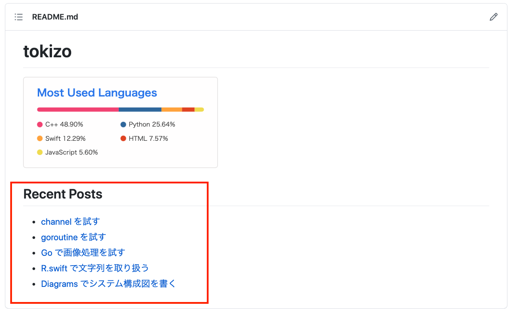
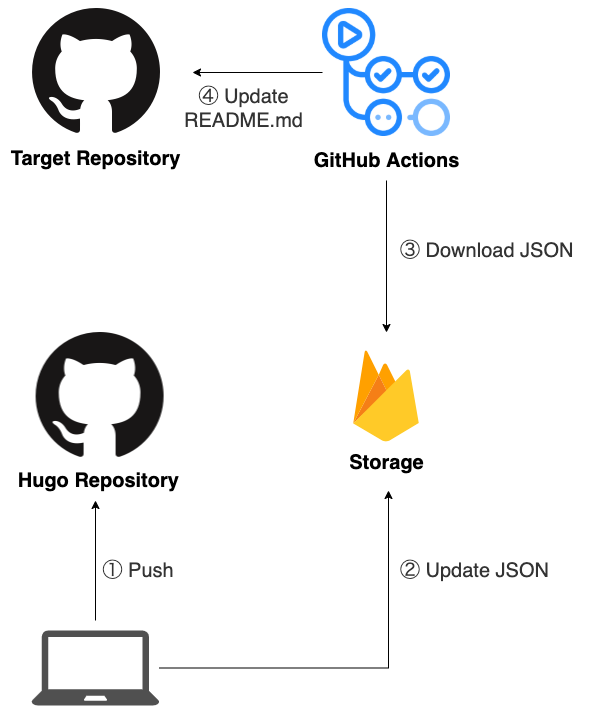

  
タイトル決めが難しい。  
  
<!--more-->  
  
## 開発環境  
  
```bash
> go version
go version go1.15.5 darwin/amd64

python-version: '3.9'
```
  
## つくったもの
  
  
  
ブログ（Hugo）の最新5記事を README.md に自動反映。  
  
## 構成・手順
  
  
  
　
  
1. Hugo リポジトリに push 
2. 1 をトリガーに記事取得スクリプトを実行し、実行結果を元に Firebase storage の記事一覧ファイルをアップデート
3. Target Repository に設定している GitHub Actions で Firebase storage の記事一覧ファイルをダウンロード  
4. 3 を元に README.md を更新
  
## 記事取得 & Firebase storageにアップロードするスクリプト (手順2)  
  
Hugo リポジトリ内の記事ファイル一覧から最新5記事の下記項目を抽出して、 JSON として出力し、Firebase storage にアップロード。  
  
- タイトル
- 記事URL
- 日付
- タグ
  
スクリプトの実行タイミング は push直前（Git hooks の pre-push）。  
  
#### 記事取得 & Firebase storageにアップロードするスクリプト (Go)
  
```go
package main

import (
	"bufio"
	"context"
	"encoding/json"
	"io"
	"io/ioutil"
	"log"
	"os"
	"path/filepath"
	"sort"
	"strings"

	"cloud.google.com/go/storage"
	firebase "firebase.google.com/go"

	"github.com/joho/godotenv"
	"google.golang.org/api/option"
)

type Article struct {
	Title string   `json:"title"`
	Url   string   `json:"url"`
	Date  string   `json:"date"`
	Tags  []string `json:"tags"`
}

func main() {
	var articles []Article
	err := filepath.Walk("./../content/posts", func(path string, info os.FileInfo, err error) error {
		if !strings.HasSuffix(path, "index.md") {
			return nil
		}

		artcle, err := extractAllArticles(path)
		if err != nil {
			log.Fatal(err.Error())
		}
		articles = append(articles, artcle)
		return nil
	})
	if err != nil {
		log.Fatal(err.Error())
	}

	extractedArticles := extractArticles(articles, 5, true)
	data, err := json.Marshal(&extractedArticles)
	if err != nil {
		log.Fatal(err.Error())
	}

	ioutil.WriteFile("tmp.json", data, os.ModePerm)
	uploadFirebaseStorage()
}

func extractAllArticles(path string) (article Article, err error) {

	fp, err := os.Open(path)
	if err != nil {
		return Article{}, err
	}
	defer fp.Close()

	artcle := Article{}

	isBeforeTags := false
	scanner := bufio.NewScanner(fp)
	for scanner.Scan() {
		line := scanner.Text()

		if isBeforeTags {
			if len(line) >= 3 && line[:3] == "---" {
				break
			} else {
				artcle.Tags = append(artcle.Tags, line[2:])
				continue
			}
		}

		if len(line) >= 6 && strings.HasPrefix(line, "title:") {
			rowTitle := line[7:]
			artcle.Title = rowTitle[1 : len(rowTitle)-1]
			continue
		}

		if len(line) >= 5 && strings.HasPrefix(line, "date:") {
			artcle.Date = line[6:]
			continue
		}

		if len(line) >= 4 && strings.HasPrefix(line, "tags:") {
			isBeforeTags = true
		}
	}

    // スライスの位置指定のハードコードは避けたい
    // -> 正規表現書く？
	artcle.Url = "https://tokizuoh.dev/posts/" + path[17:len(path)-8]
	return artcle, nil
}

func extractArticles(articles []Article, num int, desc bool) []Article {
	sort.Slice(articles, func(i, j int) bool {
		if desc {
			return articles[i].Date > articles[j].Date
		} else {
			return articles[i].Date < articles[j].Date
		}
	})

	if len(articles) < num {
		num = len(articles)
	}
	return articles[:num]
}

func uploadFirebaseStorage() {
	err := godotenv.Load("./../.env")
	if err != nil {
		log.Fatal(err.Error())
	}

	storageBucketURL := os.Getenv("STORAGE_BUCKET_URL")
	crendentialFilePath := os.Getenv("CREDENTIAL_FILE_PATH")

	config := firebase.Config{
		StorageBucket: storageBucketURL,
	}
	opt := option.WithCredentialsFile(crendentialFilePath)
	app, err := firebase.NewApp(context.Background(), &config, opt)
	if err != nil {
		log.Fatal("error initializing app:", err.Error())
	}

	client, err := app.Storage(context.Background())
	if err != nil {
		log.Fatal(err.Error())
	}

	bucket, err := client.DefaultBucket()
	if err != nil {
		log.Fatalln(err.Error())
	}

	localFilename := "tmp.json"
	remoteFilename := "articles.json"
	contentType := "application/json"
	ctx := context.Background()

	writer := bucket.Object(remoteFilename).NewWriter(ctx)
	writer.ObjectAttrs.ContentType = contentType
	writer.ObjectAttrs.CacheControl = "no-cache"
	writer.ObjectAttrs.ACL = []storage.ACLRule{
		{
			Entity: storage.AllUsers,
			Role:   storage.RoleOwner,
		},
	}

	f, err := os.Open(localFilename)
	if _, err = io.Copy(writer, f); err != nil {
		log.Fatalln(err)
	}
	defer f.Close()

	if err := writer.Close(); err != nil {
		log.Fatalln(err)
	}
	log.Println("COMPLETE!")
}
```  
  
　
  
実行すると下記のような JSON ファイルが firebase storage にアップロードされる。  
  
```json
[{"title":"Hugo の直近の記事を GitHub の README.md に反映させる","url":"https://tokizuoh.dev/posts/xex14jq5youcrbs3/","date":"2021-05-07T20:42:56+09:00","tags":["hugo","golang","python","github"]},{"title":"channel を試す","url":"https://tokizuoh.dev/posts/crz6l6c3wms5ipy7/","date":"2021-05-03T19:43:23+09:00","tags":["golang"]},{"title":"goroutine を試す","url":"https://tokizuoh.dev/posts/ndw8rong3nmj0n0m/","date":"2021-05-02T19:42:51+09:00","tags":["golang","docker"]},{"title":"Go で画像処理を試す","url":"https://tokizuoh.dev/posts/nlwaqdj3aw0bxsb6/","date":"2021-05-01T15:07:06+09:00","tags":["golang"]},{"title":"R.swift で文字列を取り扱う","url":"https://tokizuoh.dev/posts/ddf0ro8z5g7o9d6w/","date":"2021-04-30T09:13:24+09:00","tags":["swift"]}]
```
  
## README.md 更新スクリプト (手順3, 4)  
  
GitHub Actions を使って README.md を更新するスクリプトを定期的に実行させる。  
  
#### README.md 更新スクリプト (Python)
  
```python
import os
import json
import textwrap

import firebase_admin
from firebase_admin import credentials
from firebase_admin import storage

DOWNLOAD_FILE_NAME = 'articles.json'
GENERATE_FILE_NAME = 'README.md'
FIREBASE_ACCESS_TOKEN_FILE = '{ACCESS_TOKEN_FILE_PATH}'


def download_blob(bucket_name, source_blob_name, destination_file_name):
    bucket = storage.bucket(bucket_name)
    blob = bucket.blob(source_blob_name)
    blob.download_to_filename(destination_file_name)
    print("Blob {} downloaded to {}.".format(source_blob_name, destination_file_name))

    
def main():
    
    STORAGE_BUCKET_URL = os.environ.get("STORAGE_BUCKET_URL")
    
    cred = credentials.Certificate(FIREBASE_ACCESS_TOKEN_FILE)
    firebase_admin.initialize_app(cred, {
        'storageBucket': storage
    })

    download_blob(STORAGE_BUCKET_URL, DOWNLOAD_FILE_NAME, DOWNLOAD_FILE_NAME)

    f = open(DOWNLOAD_FILE_NAME, 'r')
    d = json.load(f)

    # dedent: 各行の先頭の空白削除 (formatのa1, u1...の処理は動的にできそう)
    docs_str = textwrap.dedent("""\
    # tokizo
    [](https://github.com/anuraghazra/github-readme-stats)
    ## Recent Posts
    - [{a1}]({u1})
    - [{a2}]({u2})
    - [{a3}]({u3})
    - [{a4}]({u4})
    - [{a5}]({u5})""").format(
        a1=d[0]['title'],
        u1=d[0]['url'],
        a2=d[1]['title'],
        u2=d[1]['url'],
        a3=d[2]['title'],
        u3=d[2]['url'],
        a4=d[3]['title'],
        u4=d[3]['url'],
        a5=d[4]['title'],
        u5=d[4]['url'],
    )

    with open(GENERATE_FILE_NAME, 'w') as f:
        f.write(docs_str)


if __name__ == '__main__':
    main()

```
  
#### GitHub Actions ワークフロー設定ファイル (YAML)
  
```yaml
name: Update_README

on:
  schedule:
    - cron: '0 0 * * *'
  workflow_dispatch:

jobs:
  main:
    runs-on: ubuntu-latest
    env:
      FIREBASE_ACCESS_TOKEN: ${{ secrets.FIREBASE_ACCESS_TOKEN }}
      STORAGE_BUCKET_URL: ${{ secrets.STORAGE_BUCKET_URL }}
    steps:
      - uses: actions/checkout@v2
      - uses: actions/setup-python@v2
        with:
          python-version: '3.9'
          architecture: 'x64'
      - name: pip setting
        uses: BSFishy/pip-action@v1
        with:
          packages: firebase_admin
      - name: access-token setting & run python
        working-directory: scripts
        run: |
          echo $FIREBASE_ACCESS_TOKEN >> {ACCESS_TOKEN_FILE_PATH}
          python main.py
          mv README.md ./../README.md
      - name: git setting
        run: |
          git config --local user.email {EMAIL_ADDRESS}
          git config --local user.name {USER_ID}
      - name: commit files
        run: |
          git add README.md
          git commit -m 'update README.md'
          git push origin master

```
  
  
## 所感  
  
- 関数の命名や main 関数に処理を詰め込みすぎ → Goは機能別でパッケージ分けたほうがスッキリしそう  
- GitHub Actions 初めて触った。ジョブの動かし方（直列・並列）も楽に書けて良い  
  
## 参考  
  
- [textwrap --- テキストの折り返しと詰め込み — Python 3.9.4 ドキュメント](https://docs.python.org/ja/3/library/textwrap.html)  
- [GitHub Actionsのドキュメント - GitHub Docs](https://docs.github.com/ja/actions)  
  