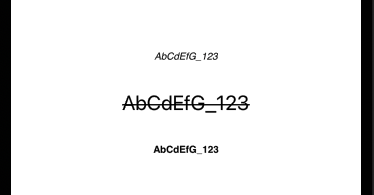

  
<!--more-->  
  
## 開発環境  
  
```bash
> xcodebuild -version
Xcode 13.0
Build version 13A233
```
  
## init(markdown:options:baseURL:)
  
```swift
convenience init(markdown: String,
                 options: AttributedString.MarkdownParsingOptions = .init(),
                 baseURL: URL? = nil) throws
```
  
[init(markdown:options:baseURL:) | Apple Developer Documentation](https://developer.apple.com/documentation/foundation/nsattributedstring/3796597-init)
  
iOS15 から、NSAttributedString に Markdown 文字列が指定可能なイニシャライザが追加された。  
  
## 使ってみる
  
```swift
import UIKit

final class ViewController: UIViewController {

    @IBOutlet weak private var italicTextLabel: UILabel!
    @IBOutlet weak private var cancellationTextLabel: UILabel!
    @IBOutlet weak private var boldTextLabel: UILabel!
    
    private let text = "AbCdEfG_123"
    
    override func viewDidLoad() {
        super.viewDidLoad()
        
        italicTextLabel.attributedText = try? .init(markdown: "*\(text)*")
        cancellationTextLabel.attributedText = try? .init(markdown: "~\(text)~")
        boldTextLabel.attributedText = try? .init(markdown: "**\(text)**")
    }

}
```
  
  
  
## 参考  
  
- [init(markdown:options:baseURL:) | Apple Developer Documentation](https://developer.apple.com/documentation/foundation/nsattributedstring/3796597-init)  
  