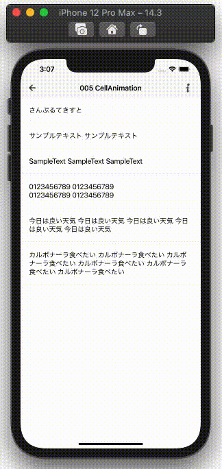

  
アニメーションは時間が溶ける。  
  
<!--more-->  
  
## 開発環境  
  
```bash
> xcodebuild -version
Xcode 12.3
Build version 12C33
```
  
## gif
  
  
  
- 選択したセルに対して、左から右に紫の UIView をスライド表示
- セル選択時に、直前まで選択していたセルに対して、紫の UIView をフェードアウト
  
## 方針  
  
Xib上で UILabel の背景として紫のViewを設定すると、背景をスライドさせた時に UILabel も付随してスライドしてしまうので、紫の UIView はコード上で UILabel の下に配置させた
  
## コード
  
[GitHub PR](https://github.com/tokizuoh/Pendula/pull/60)  
  
　
  
以下ポイントとなるコードを抜粋。  
  
#### UITableViewDelegate
  
```swift
extension FadeAnimationListViewController: UITableViewDelegate {

    func tableView(_ tableView: UITableView, heightForRowAt indexPath: IndexPath) -> CGFloat {
        return UITableView.automaticDimension
    }

    func tableView(_ tableView: UITableView, didSelectRowAt indexPath: IndexPath) {
        if let beforeIndexPath = beforeIndexPath,
           let cell = tableView.cellForRow(at: beforeIndexPath) as? FadeAnimationTableViewCell {
            guard beforeIndexPath != indexPath else {
                return
            }
            // 最後に選択したindexPathと今選択したindexPathが異なる時は 非表示 アニメーションを実行
            cell.removeAnimationBackgroundViewFromSuperViewWithFadeOut()
        }

        guard let cell = tableView.cellForRow(at: indexPath) as? FadeAnimationTableViewCell else {
            return
        }
        // 表示アニメーションを実行
        cell.animateWithSlideFromLeading()
        beforeIndexPath = indexPath
    }

}
```
  
#### UITableViewCell  
  
```swift
extension FadeAnimationTableViewCell {

    func animateWithSlideFromLeading() {
        animationBackgroundView?.removeFromSuperview()

        animationBackgroundView = UIView(frame: CGRect(x: 0, y: 0,
                                                       width: bounds.width,
                                                       height: bounds.height))
        guard let animationBackgroundView = animationBackgroundView else {
            return
        }

        animationBackgroundView.backgroundColor = generateCustomPurple(alpha: 0.5)
        animationBackgroundView.translatesAutoresizingMaskIntoConstraints = false
        self.addSubview(animationBackgroundView)

        // 紫の UIView を背面に配置
        self.sendSubviewToBack(animationBackgroundView)
        
        // UILabel を前面に配置
        self.bringSubviewToFront(textLabel!)

        animationBackgroundView.widthAnchor.constraint(equalToConstant: bounds.width).isActive = true
        animationBackgroundView.heightAnchor.constraint(equalToConstant: bounds.height).isActive = true
        animationBackgroundView.centerYAnchor.constraint(equalTo: self.centerYAnchor).isActive = true

        let constraint = NSLayoutConstraint(item: animationBackgroundView,
                                            attribute: .leading,
                                            relatedBy: .equal,
                                            toItem: self,
                                            attribute: .leading,
                                            multiplier: 1.0,
                                            constant: 0)
        self.addConstraint(constraint)
        UIView.animate(withDuration: 1.0) {
            animationBackgroundView.center.x += self.bounds.width
        }
    }
    
}
```
  
## 参考  
  
- [bringSubviewToFront(_:) | Apple Developer Documentation](https://developer.apple.com/documentation/uikit/uiview/1622541-bringsubviewtofront)  
- [sendSubviewToBack(_:) | Apple Developer Documentation](https://developer.apple.com/documentation/uikit/uiview/1622618-sendsubviewtoback)  
  