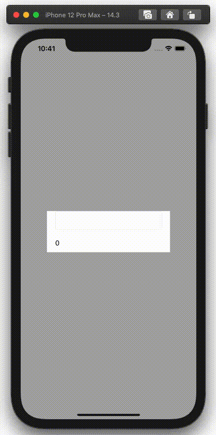

  
参考： [iOSアプリ設計パターン入門](https://peaks.cc/books/iOS_architecture)  
  
<!--more-->  
  
## 開発環境  
  
```bash
> xcodebuild -version
Xcode 12.3
Build version 12C33
```
  
## Cocoa MVC  
GUIアーキテクチャの一つ。他のアーキテクチャに MVVM や MVP などが挙げられる。  
  
#### 役割
  
- Model: データ保持、ビジネスロジック定義  
- View: Model のデータ表示  
- Controller: View と Model の仲介  
  
#### 特徴  
  
- View と Model が完全に独立  
- Controller から View, Model をそれぞれ参照  
  
詳しくは [iOSアプリ設計パターン入門](https://peaks.cc/books/iOS_architecture) を参照。  
  
　
  
本記事では Cocoa MVC で文字列カウンターを実装した内容を記載する。  
  
## gif
  
  
  
UITextField に入力された文字列の長さを UILabel に表示する。  
  
## コード  
  
基本的な Model, View, Controller を記載する。  
  
#### Model  
  
```swift
final class Model {
    let notificationCenter = NotificationCenter.default
    
    private(set) var textCount = 0 {
        didSet {
            notificationCenter.post(name: .init("textCount"),
                                    object: nil,
                                    userInfo: ["textCount": textCount])
        }
    }
    
    func updateTextCount(text: String) {
        textCount = text.count
    }
}
```
  
#### View
  
```swift
import UIKit

final class CustomView: UIView {
    @IBOutlet weak var textField: UITextField!
    @IBOutlet weak var textCountLabel: UILabel!
    
    override init(frame: CGRect) {
        super.init(frame: frame)
        loadNib()
    }
    
    required init?(coder: NSCoder) {
        super.init(coder: coder)
        loadNib()
    }
    
    private func loadNib() {
        let view = Bundle.main.loadNibNamed("CustomView", owner: self, options: nil)?.first as! UIView
        view.frame = self.bounds
        self.addSubview(view)
    }
}
```
  
#### Controller
  
```swift
import UIKit

final class ViewController: UIViewController {

    @IBOutlet weak var customView: CustomView! {
        didSet {
            customView.textField.delegate = self
        }
    }
    
    private var model: Model? {
        didSet {
            updateModel()
        }
    }
    
    override func viewDidLoad() {
        super.viewDidLoad()
        
        /*
         今回は単一のControllerなので直接依存を注入しているが、
         他画面からの遷移時に依存性を注入してあげると使い回しが効く
        */
        model = Model()
    }
    
    deinit {
        model?.notificationCenter.removeObserver(self)
    }
    
    private func updateModel() {
        guard let model = model else {
            return
        }
        
        customView.textCountLabel.text = model.textCount.description
        model.notificationCenter.addObserver(forName: .init("textCount"),
                                             object: nil,
                                             queue: nil) { [weak self] notification in
            if let textCount = notification.userInfo?["textCount"] as? Int {
                self?.customView.textCountLabel.text = "\(textCount)"
            }
        }
    }
}

extension ViewController: UITextFieldDelegate {
    func textFieldShouldReturn(_ textField: UITextField) -> Bool {
        let text = textField.text ?? ""
        model?.updateTextCount(text: text)
        return true
    }
}

```
  
## 感想  
  
- View, Model の再利用性が高い  
- Model 更新時の処理が重複している（ View の更新処理）  
- View, Model の数が増加すると Controller が Fat になる  
- View, Model の数が増加すると NotificationCenter が増え、管理が複雑になり、処理の流れが追いにくくなる
  
## 参考  
  
- [PEAKS（ピークス）｜iOSアプリ設計パターン入門](https://peaks.cc/books/iOS_architecture)  
- [Model-View-Controller](https://developer.apple.com/library/archive/documentation/General/Conceptual/DevPedia-CocoaCore/MVC.html)  
  