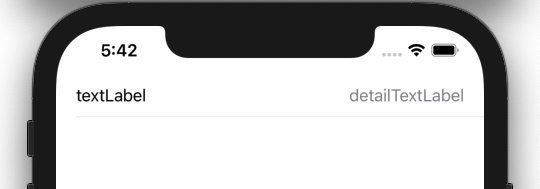
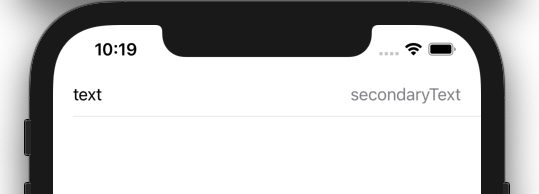

  
<!--more-->  
  
## 開発環境  
  
```bash
> xcodebuild -version
Xcode 12.3
Build version 12C33
```
  
## detailTextLabelとは  
  
  
  
```swift
import UIKit

class ViewController: UIViewController {

    @IBOutlet weak var tableView: UITableView!
    
    override func viewDidLoad() {
        super.viewDidLoad()
        
        self.tableView.dataSource = self
        self.tableView.tableFooterView = UIView(frame: .zero)
    }
}

extension ViewController: UITableViewDataSource {
    func tableView(_ tableView: UITableView, numberOfRowsInSection section: Int) -> Int {
        1
    }
    
    func tableView(_ tableView: UITableView, cellForRowAt indexPath: IndexPath) -> UITableViewCell {
        let cell = UITableViewCell(style: .value1, reuseIdentifier: "value1")
        cell.textLabel?.text = "textLabel"

        // ココ！
        cell.detailTextLabel?.text = "detailTextLabel"
        return cell
    }
}
```
  
## detailTextLabelがiOS14.0で非推奨に  
  
> Use a content configuration to manage the cell’s text instead. Use [defaultContentConfiguration()](https://developer.apple.com/documentation/uikit/uitableviewcell/3601058-defaultcontentconfiguration)...  
> [detailTextLabel | Apple Developer Documentation](https://developer.apple.com/documentation/uikit/uitableviewcell/1623273-detailtextlabel)  
  
defaultContentConfiguration()を使用し設定を加えていく。  
[textLabel](https://developer.apple.com/documentation/uikit/uitableviewcell/1623210-textlabel)も同様にiOS14.0で非推奨に。  
  
  
## defaultContentConfiguration()
  
  
  
```swift
import UIKit

class ViewController: UIViewController {

    @IBOutlet weak var tableView: UITableView!
    
    override func viewDidLoad() {
        super.viewDidLoad()
        
        self.tableView.dataSource = self
        self.tableView.tableFooterView = UIView(frame: .zero)
    }
}

extension ViewController: UITableViewDataSource {
    func tableView(_ tableView: UITableView, numberOfRowsInSection section: Int) -> Int {
        1
    }
    
    func tableView(_ tableView: UITableView, cellForRowAt indexPath: IndexPath) -> UITableViewCell {
        let cell = UITableViewCell(style: .value1, reuseIdentifier: "value1")

        // ココ！
        var content = cell.defaultContentConfiguration()
        content.text = "text"
        content.secondaryText = "secondaryText"
        cell.contentConfiguration = content
        return cell
    }
}

```
  
## 参考  
  
- [detailTextLabel | Apple Developer Documentation](https://developer.apple.com/documentation/uikit/uitableviewcell/1623273-detailtextlabel)  
- [defaultContentConfiguration() | Apple Developer Documentation](https://developer.apple.com/documentation/uikit/uitableviewcell/3601058-defaultcontentconfiguration)  
- [automaticallyUpdatesContentConfiguration | Apple Developer Documentation](https://developer.apple.com/documentation/uikit/uitableviewcell/3600585-automaticallyupdatescontentconfi)  
  