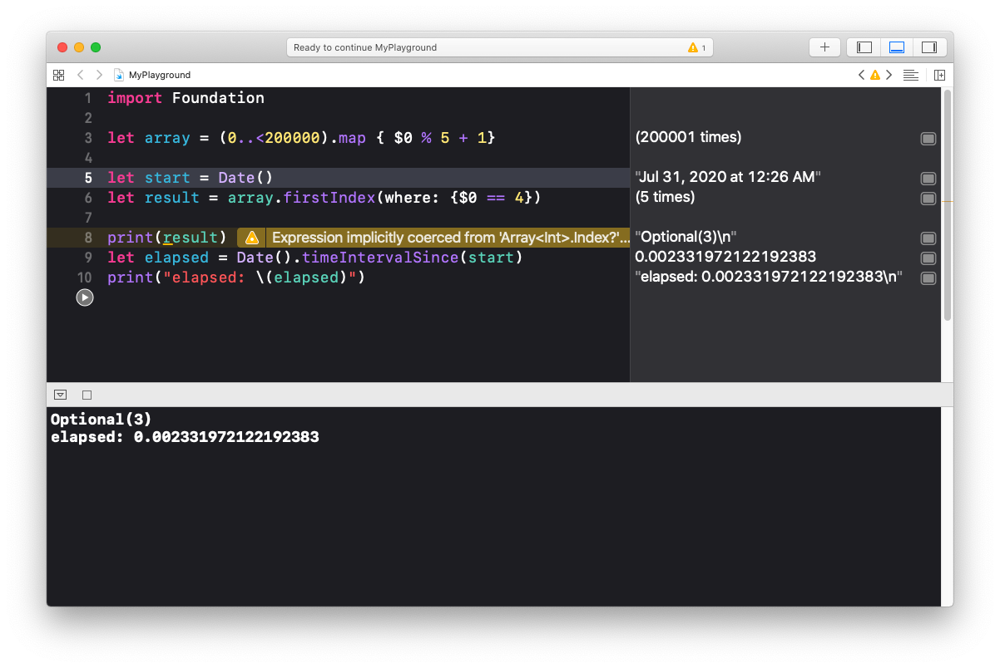

  
計算量の意識大事！  
<!--more-->  
  
## 配列の最初に出現する要素の要素番号を取得 (filter + first)  
  
```swift
import Foundation

let array = (0..<200000).map { $0 % 5 + 1 }  // {1, 2, 3, 4, 5, 1, 2, 3, ...}

let start = Date()
let result = array.enumerated().filter { $0.element == 4 }.first!

print(result)
let elapsed = Date().timeIntervalSince(start)
print("elapsed: \(elapsed)")

```
  
```bash
(offset: 3, element: 4)  # offsetが要素番号
elapsed: 2.2043009996414185
```
  
2秒もかかっている。  
前から後ろまで全て見た中で、条件に合致するもののうち、最初の要素番号と要素を取得している。  
  
## 配列の最初に出現する要素の要素番号を取得 (firstIndex)  
  
```swift
import Foundation

let array = (0..<200000).map { $0 % 5 + 1}

let start = Date()
let result = array.firstIndex(where: {$0 == 4})

print(result)
let elapsed = Date().timeIntervalSince(start)
print("elapsed: \(elapsed)")
```
  
```bash
Optional(3)
elapsed: 0.002025008201599121
```
  
filter, firstを用いた実装より速い。  
  
　
  
  
Playgroundを見る限り、条件に合致したものを見つけ次第処理を終えている。  
  
## 参考  
- [firstIndex(where:) | Apple Developer Documentation](https://developer.apple.com/documentation/swift/array/2994722-firstindex)  
- [Swiftのfirst(where:)のパフォーマンスについて - Qiita](https://qiita.com/shtnkgm/items/928630d692cf1e5b0846)  
- [【TIPS】今すぐ .filter{...}.first をやめましょう - Qiita](https://qiita.com/lovee/items/eb6ce12408d85a1bb23a)  