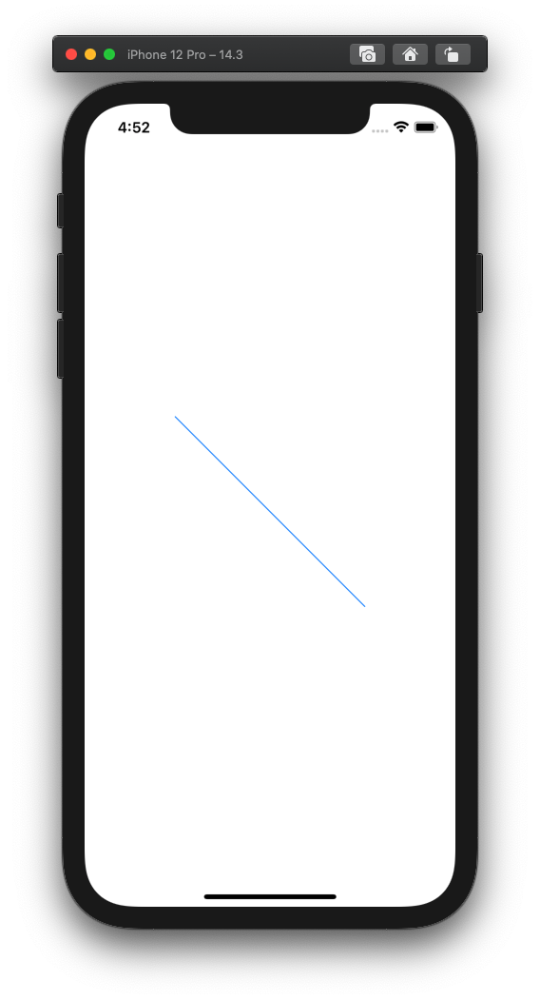
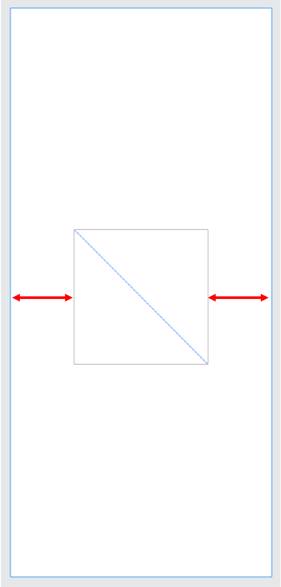
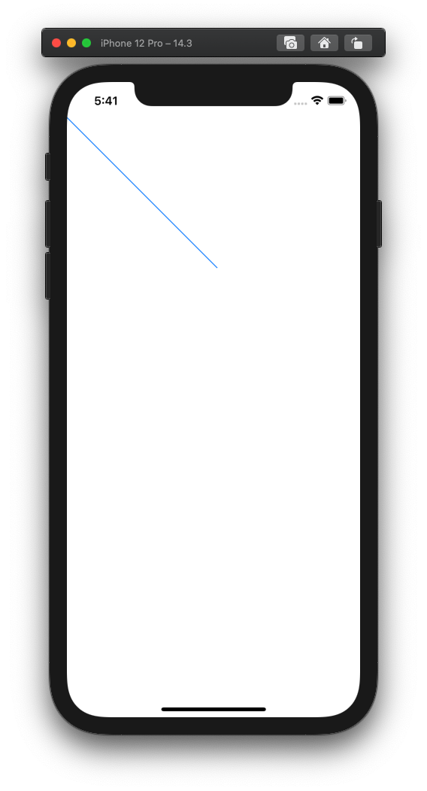
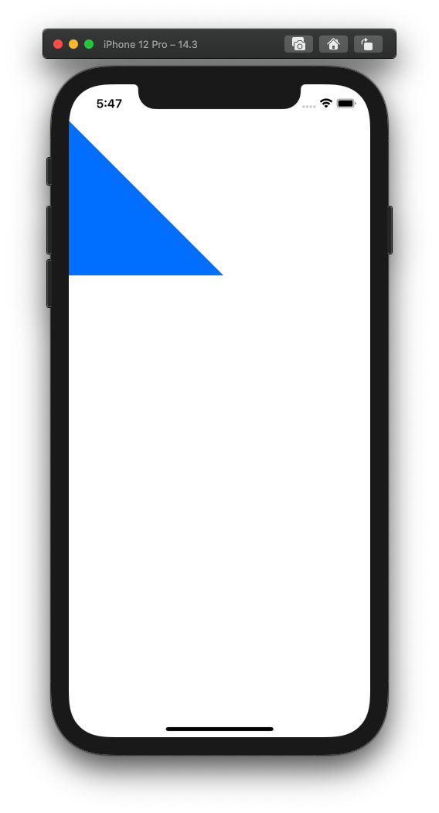
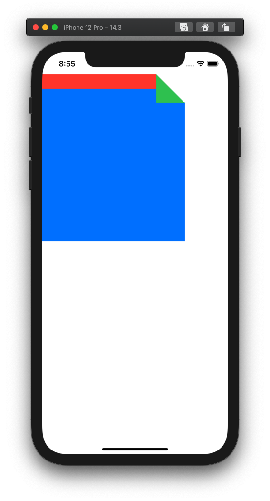

  
直感的に書けて良さそう。  
  
<!--more-->  
  
## 開発環境  
  
```bash
> xcodebuild -version
Xcode 12.3
Build version 12C33
```
  
## 直線  
  

  
```swift
import SwiftUI

struct ContentView: View {
    var body: some View {
        Path { path in
            path.move(to: CGPoint(x: 0, y: 0))
            path.addLine(to: CGPoint(x: 200, y: 200))
        }
        .stroke()
        .fill(Color.blue)
        .frame(width: 200, height: 200)
    }
}
```
  
---
  
  
始点を(0, 0)に指定したのに左右にマージンが入ってしまう。  
描画領域を画面全体にする場合は `.infinity` を使う。  
  
　
  

  
```swift
import SwiftUI

struct ContentView: View {
    var body: some View {
        Path { path in
            path.move(to: CGPoint(x: 0, y: 0))
            path.addLine(to: CGPoint(x: 200, y: 200))
        }
        .stroke()
        .fill(Color.blue)
        .frame(maxWidth: .infinity, maxHeight: .infinity)
    }
}

```
  
## 三角形
  
  
  
```swift
import SwiftUI

struct ContentView: View {
    var body: some View {
        Path { path in
            path.move(to: CGPoint(x: 0, y: 0))
            path.addLine(to: CGPoint(x: 200, y: 200))
            path.addLine(to: CGPoint(x: 0, y: 200))
        }
        .fill(Color.blue)
        .frame(maxWidth: .infinity, maxHeight: .infinity)
    }
}
```
  
## scrapboxのピン留めページ
  
  
  
```swift
import SwiftUI

struct ContentView: View {
    var body: some View {
        ZStack {
            Path { path in
                path.move(to: CGPoint(x: 0, y: 0))
                path.addLine(to: CGPoint(x: 300, y: 0))
                path.addLine(to: CGPoint(x: 300, y: 350))
                path.addLine(to: CGPoint(x: 0, y: 350))
            }
            .fill(Color.blue)
            
            Path { path in
                path.move(to: CGPoint(x: 0, y: 0))
                path.addLine(to: CGPoint(x: 300, y: 0))
                path.addLine(to: CGPoint(x: 300, y: 30))
                path.addLine(to: CGPoint(x: 0, y: 30))
            }
            .fill(Color.red)
            
            Path { path in
                path.move(to: CGPoint(x: 240, y: 0))
                path.addLine(to: CGPoint(x: 300, y: 60))
                path.addLine(to: CGPoint(x: 240, y: 60))
            }
            .fill(Color.green)
            
            Path { path in
                path.move(to: CGPoint(x: 240, y: 0))
                path.addLine(to: CGPoint(x: 300, y: 0))
                path.addLine(to: CGPoint(x: 300, y: 60))
            }
            .fill(Color.white) // 無理やり感
        }
    }
}
```
  
ZStack使えばある程度は書けそう。  
  