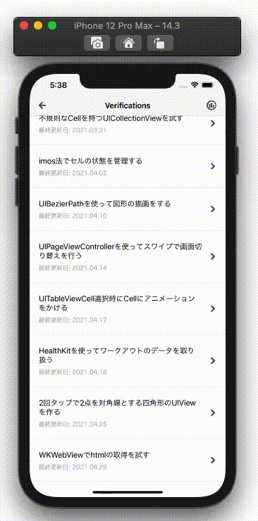

  
<!--more-->  
  
## 開発環境  
  
```bash
> xcodebuild -version
Xcode 12.3
Build version 12C33
```
  
## つくったもの  
  
  
  
　
  
[ブログ](https://tokizuoh.dev/)の先頭記事のタイトルを取得した。  
  
## コード
  
```swift
import UIKit
import WebKit

// ComponentBaseViewController
// : https://github.com/tokizuoh/Pendula/blob/develop/Pendula/View/Common/ComponentBaseViewController.swift
final class CustomWebViewController: ComponentBaseViewController {

    @IBOutlet weak var webView: WKWebView!
    @IBOutlet weak var activityIndicator: UIActivityIndicatorView!
    @IBOutlet weak var firstArticleTitleLabel: UILabel!
    @IBOutlet weak var getHTMLButton: UIButton! {
        didSet {
            getHTMLButton.isEnabled = false
            getHTMLButton.layer.shadowOffset = CGSize(width: 0, height: 2)
            getHTMLButton.layer.shadowColor = UIColor.black.cgColor
            getHTMLButton.layer.shadowOpacity = 0.5
            getHTMLButton.layer.shadowRadius = 4
            getHTMLButton.backgroundColor = .white
            getHTMLButton.layer.cornerRadius = 4
        }
    }

    @IBAction private func getHTML(_ sender: Any) {
        webView.evaluateJavaScript("document.getElementsByClassName('inner')[0].innerHTML") { [weak self] (value, error) in
            guard error == nil,
                  let htmlStr = value as? String else {
                return
            }

            guard let regex = try? NSRegularExpression(pattern: "<h2 class=\"title\">(.*)</h2>") else {return}
            let matches = regex.matches(in: htmlStr, range: NSRange(location: 0, length: htmlStr.count))

            for match in matches {
                let start = htmlStr.index(htmlStr.startIndex, offsetBy: match.range(at: 1).location)
                let end = htmlStr.index(start, offsetBy: match.range(at: 1).length)
                let text = String(htmlStr[start..<end])
                self?.firstArticleTitleLabel.text = text
                break
            }
        }

    }

    override func viewDidLoad() {
        super.viewDidLoad()

        configureNavigationItem(navigationTitle: "008 WebView",
                                blogURL: nil,
                                githubPRURL: nil)
        configureActivityIndicator()
        configureWebView()
    }

}

// MARK: - WKWebView
extension CustomWebViewController {

    private func configureWebView() {
        webView.navigationDelegate = self
        let url = URL(string: "https://tokizuoh.dev/")
        let request = URLRequest(url: url!)
        webView.load(request)
    }

}

// MARK: - UIActivityIndicator
extension CustomWebViewController {

    private func configureActivityIndicator() {
        activityIndicator.hidesWhenStopped = true
        activityIndicator.startAnimating()
    }

}

// MARK: - WKNavigationDelegate
extension CustomWebViewController: WKNavigationDelegate {

    func webView(_ webView: WKWebView, decidePolicyFor navigationResponse: WKNavigationResponse, decisionHandler: @escaping (WKNavigationResponsePolicy) -> Void) {
        DispatchQueue.main.asyncAfter(deadline: .now() + 1.5) { [weak self] in
            self?.activityIndicator.stopAnimating()
            decisionHandler(.allow)
        }
    }

    func webView(_ webView: WKWebView, didFinish navigation: WKNavigation!) {
        getHTMLButton.isEnabled = true
    }

}

```
  
## 参考  
  
- [Document.getElementsByClassName() - Web API | MDN](https://developer.mozilla.org/ja/docs/Web/API/Document/getElementsByClassName)  
- [evaluateJavaScript(_:completionHandler:) | Apple Developer Documentation](https://developer.apple.com/documentation/webkit/wkwebview/1415017-evaluatejavascript)  
- [WKNavigationDelegate | Apple Developer Documentation](https://developer.apple.com/documentation/webkit/wknavigationdelegate)  
  