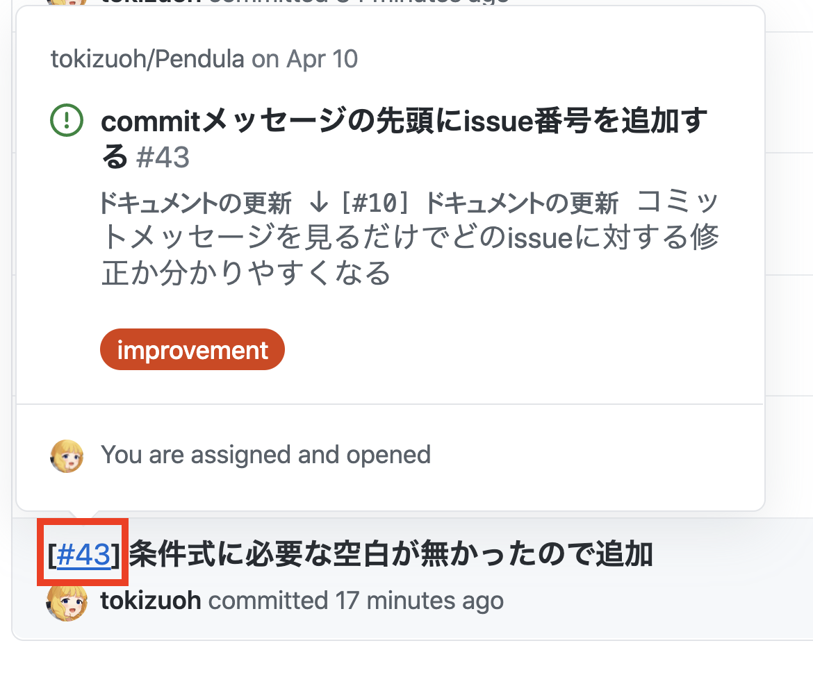

  
GitHubでcommitメッセージにissue番号が付いているとリンク辿れるので便利。
<!--more-->  
  
## 開発環境  
  
```bash
> git --version
git version 2.24.3 (Apple Git-128)
```
  
## やったこと
  
  
  
　
  
git-hooksのcommit-msgを使って、commitメッセージの先頭にissue番号を付与するスクリプトを書いた。  
GitHubの場合、commitメッセージにissue番号が付いていると該当issueのリンクが付与されるので便利。  
  
## コード
  
```bash
#!/bin/sh

mv $1 $1.tmp

## シェルスクリプトは可読性が下がりやすい記述がしやすいので、なるべく変数にいれて可読性を向上させた
## (パイプが連続したりすると読みにくくなって、保守性が悪くなる）
commit_message=`cat $1.tmp`

## egrep --only-matching: マッチした箇所だけ出力
issue_number=`git branch | grep '*' | awk '{print $2}' | egrep --only-matching '#\d+'`

## $issue_numberの空文字判定
if [ -z "$issue_number" ]; then
  echo "[ERROR] Please include issue number in branch name."
  echo "ex.) feature/#13"
  exit 1
fi

res="[${issue_number}] ${commit_message}"
echo $res > $1
```
  
[GitHub PR](https://github.com/tokizuoh/Pendula/pull/45)  
  
## 参考  
  
- [【 grep 】コマンド（応用編その2）――複数の文字列を検索する：Linux基本コマンドTips（11） - ＠IT](https://www.atmarkit.co.jp/ait/articles/1604/15/news019.html)  
  