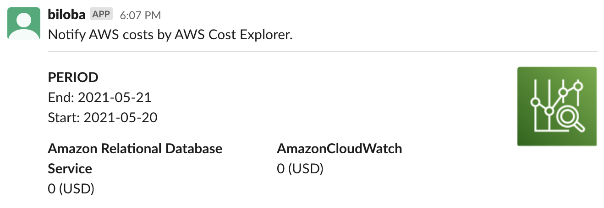

  
AWS を勉強する際にコスト面が気になったので作った。  
  
<!--more-->  
  
## 開発環境  
  
```bash
> go version
go version go1.16.3 linux/amd64
```
  
## やること  
  
- [AWS Cost Explorer](https://aws.amazon.com/jp/aws-cost-management/aws-cost-explorer/) で取得したサービスごとの料金を Slack に通知する  
  
## つくったもの  
  
  
  
## コード  
  

  
https://github.com/tokizuoh/biloba
  
#### Slack
  
```go
respChannel, respTimestamp, err := c.PostMessage(os.Getenv("SLACK_CHANNEL_ID"), slack.MsgOptionBlocks(
    &slack.SectionBlock{
        Type: slack.MBTSection,
        Text: &slack.TextBlockObject{
            Type: "mrkdwn",
            Text: "Notify AWS costs by AWS Cost Explorer.",
        },
    },
    slack.NewDividerBlock(),
    slack.NewSectionBlock(
        &slack.TextBlockObject{
            Type: "mrkdwn",
            Text: generateDateStr(costOutput.TimePeriod.Start, costOutput.TimePeriod.End),
        },
        generateTextBlockObjects(costOutput),
        slack.NewAccessory(
            slack.NewImageBlockElement(os.Getenv("AWS_COST_EXPLORER_IMG_PATH"), "aws_ce"),
        ),
    ),
))
```
  
[slack-go/slack](https://github.com/slack-go/slack) を使用。  
[Block Kit](https://api.slack.com/block-kit) をラップしたものを使ったが、かなり直感的に書けた。  
  
## 参考  
  
- [AWS Cost Explorer（コストと使用状況の経時的変化を可視化）｜ AWS](https://aws.amazon.com/jp/aws-cost-management/aws-cost-explorer/)  
- [slack-go/slack: Slack API in Go - community-maintained fork created by the original author, @nlopes](https://github.com/slack-go/slack)  
- [Block Kit | Slack](https://api.slack.com/block-kit)  
  