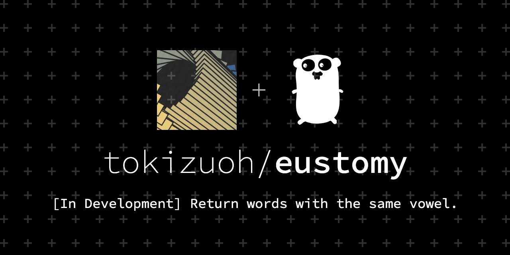

  
韻を踏みたい時に使えそう。  
  
<!--more-->  
  
## 開発環境  
  
```bash
> go version
go version go1.16.3 linux/amd64
```
  
## つくっているもの
  
- 単語をGETメソッドを使って送信すると、その単語と同じ母音を持つ単語を返すツール  
  
## 現状  
`hiori` と同じ母音(= `ioi`)を持つ単語を返してみる。  
  
```bash
> curl "localhost:8080/v1/roman?target=hiori"  | python -c 'import sys,json;print(json.dumps(json.loads(sys.stdin.read()),indent=4,ensure_ascii=False))'
  % Total    % Received % Xferd  Average Speed   Time    Time     Time  Current
                                 Dload  Upload   Total   Spent    Left  Speed
100   708  100   708    0     0  27230      0 --:--:-- --:--:-- --:--:-- 27230
[
    {
        "row": "五十路",
        "roman": "isozi",
        "vowels": "ioi"
    },
    {
        "row": "日覆",
        "roman": "hioi",
        "vowels": "ioi"
    },
    {
        "row": "気取り",
        "roman": "kidori",
        "vowels": "ioi"
    },
    {
        "row": "身持",
        "roman": "mimoti",
        "vowels": "ioi"
    },
    {
        "row": "引越",
        "roman": "hikkosi",
        "vowels": "ioi"
    },
    # 省略
]
```
  
五十路（いそじ/isozi）や日覆（ひおい/hioi）がマッチしてるから概ね良さそう。  
  
## コード （開発中）  
  
  
[tokizuoh/eustomy](https://github.com/tokizuoh/eustomy/tree/blog/zyi34tdy6a77bfoa)
  
  
## 処理の流れ
「hiori」 を例にして進める。  
  
#### ユーザー
1. サーバー（localhost:8080）に 「hiori」 をパラメータとしてGETリクエストを送る
2. 「hiori」と同じ母音（「ioi」）を持つ単語を取得
  
#### サーバー (レスポンス)
  
1. GETリクエストのパラメータとして送られてきた単語の母音を抽出する（「hiori」→「ioi」）
2. 事前に作成済みのCSVファイル（後述）から同じ母音を持つ単語を抽出
3. ユーザー側にレスポンスとして2を返す
  
#### サーバー (CSVファイル作成): ユーザーとのやり取りが発生する前に完了
  
1. [WordNet](http://compling.hss.ntu.edu.sg/wnja/)から日本語の単語が集約されているDBをローカルに落とす
2. 1の各単語に対し、[ルビ振りAPI](https://developer.yahoo.co.jp/webapi/jlp/jim/v1/conversion.html)を使って漢字/ひらがなをローマ字に変換
3. 2を元に下記のようなCSVファイルを作成  
  
```bash
raw,roman,vowels
頭金,atamakin,aaain
大砲,taihou,aiou
溢れでる,ahurederu,aueeu
検閲官,kenetukan,eneuan
吃逆,syakkuri,aui
紅土,koudo,ouo
罪ぶかい,tumibukai,uiuai
院長,intyou,inou
鈍ま,noroma,nooa
添,soe,oe
兼言,kanegoto,aneoo
食べ残し,tabenokosi,aenooi
```
  
## これからやること  
  
- エラーハンドリング
- CSVファイルからDBに移行（検索速度改善）
- 適切なパッケージの切り分け（何をもって適切かを知る）
- ローマ字データの掃除（カタカナのみ・複雑な単語はルビ振りAPIで期待したローマ字が取得できないので自前で組む必要がありそう）
- 母音抽出のロジックの見直し（今は単純に「aiueon」*1 のみ抽出しているが、な行が正常に抽出できていない）

## 参考  
  
- [日本語 Wordnet](http://compling.hss.ntu.edu.sg/wnja/)  
- [ルビ振り - Yahoo!デベロッパーネットワーク](https://developer.yahoo.co.jp/webapi/jlp/furigana/v1/furigana.html)  
  
---
  
*1: n は子音だが、nearly母音として処理をしている